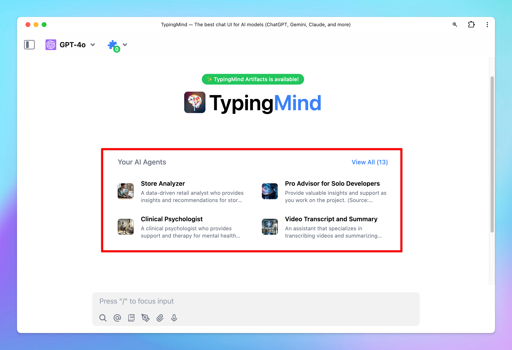
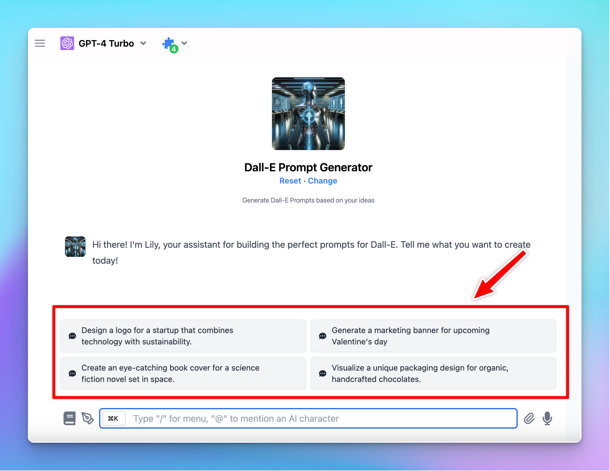
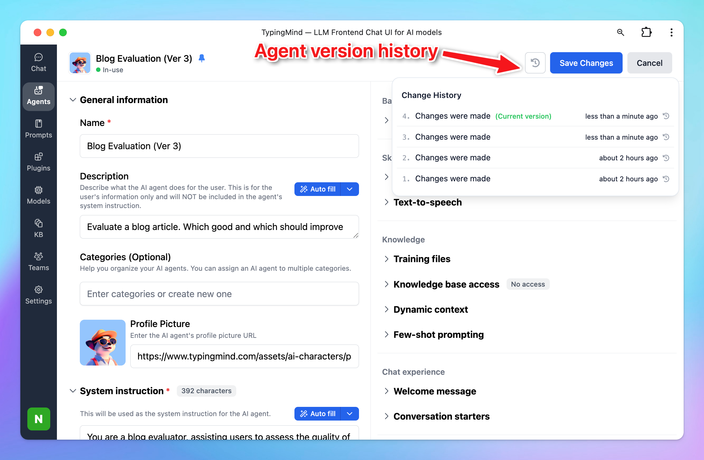

# AI Agents Overview

TypingMind app allows you to build your own **AI Agent collection** so you can turn your chat model into an expert to implement a specific task. 

The AI Agent works as an enhanced version of the [initial system instructions](https://blog.typingmind.com/unlocking-the-power-of-chatgpt's-system-instruction-on-typingmind) for AI models.

TypingMind AI Agent provides you with the power to refine and customize ChatGPT’s responses more effectively through the addition of **few-shot prompting, assigned base chat models, voice outputs, custom parameters, etc.**

This feature enables a more targeted and personalized interaction with the AI, thus improving the overall experience and effectiveness of communication.

As of now, there are 2 options to interact with AI Agent:

- You can choose to add AI Agents from TypingMind’s built-in AI Agents
- Or build your AI Agents

# **Choose from Built-in AI Agents**

TypingMind offers more than 50 pre-built AI Agents. Here’s how to add them to your library:

- Click on **Agents** menu on the left side panel
- Scroll down to explore the prebuilt ****AI Agents ****throughout different categories.
- **“Add”** the AI agents that you find most useful to your “**Your AI Agents**” collection.

The AI Agents you've just added will now be visible in the **“Your Agents”** section:

# Build **Your Own AI Agents**

You can also build your own AI Agents by:

- Click on **Agents** menu on the left side panel
- Click the “**Create AI Agent**” button on the top right corner of the app
- Fill in the necessary information

The AI Agent you create will also be displayed in the **“Your Agents”** section.

# What you can do with TypingMind’s AI Agents?

## 1. Assigned a based chat model with custom parameters

You can assign your AI Agent with:

- A specific chat model
- Custom Parameters like Temperature, Top_p, Max tokens, etc.

Toggle the Model & parameters under the Base model section to assign models and custom parameters.

This allows the AI Agent to always perform best with its custom model and settings.

## 2. Set skills for AI Agent with Plugins and Text to speech

You can assign your AI Agent with:

- Specific plugins, for example, Web Search
- A custom voice with text-to-speech

Toggle the Plugins or Text-to-speech under the Skills section to assign plugins or a voice for AI Agent.

## 3. Set knowledge for AI Agent

You have two options to upload training data for the AI Agent:

- Upload training files directly -upload directly your PDF, XLSX, CSV, TXT, etc. to the AI Agent.
- Use [Dynamic Context via API](Dynamic%20Context%20via%20API%20fc22e689952b47999aeef080cde44caf.md) - this allows you to retrieve content from an API and inject into the system prompt. This can be used to add live information to the AI or implement Retrieval-Augmented Generation (RAG) from your own data sources (e.g., vector store database).
- Use [Knowledge Base (KB)](../RAG%20Knowledge%20Base%201b97c3f1757a80b19370ffd0536e95a8.md) – this enables RAG using uploaded data. The system retrieves relevant information from your content based on the user's query.

Toggle the Training files or Dynamic Context or Knowledge Base under the Knowledge section to set up the knowledge for AI Agent. 

Here are some important notes:

- If you add training files, remember to assign a model to your AI Agent before adding the files.
- Your uploaded documents will be included directly to the model's system instruction.
- Make sure your document fits within the context length of the chosen model.
- If you use Knowledge Base (KB), upload your data via the **KB menu** (in the left workspace bar), and assign **training tags** to the documents. These tags can then be used to assign the appropriate data to specific AI Agents.

<aside>
📌

With TypingMind Custom users, you can connect your uploaded training data (via the Training Data page) to the AI Agents. Here’s how: [Connect Training Data to Your AI Agent](../TypingMind%20Team/Branding%20and%20Customizations/Connect%20knowledge%20base%20to%20your%20AI%20Agents%208e18df9644914dbf96b83c8a4b2e6123.md)

</aside>

## 4. Use Few-shot prompting

Few-shot prompting is a technique to help the AI agent learn how to respond to users in a specific way by provide demonstrations in the prompt to steer the model to better performance. 

The prompts will be automatically inserted at the beginning of every conversation, right after the system instructions (but not included in the system instruction). This is useful when you want the AI to always respond in a very specific format.

## 5. Improve the chat experience with Welcome messages and Conversation starters

The Welcome message allow the AI model to send the first greeting message when you choose to interact with it. This ensures you have a more engaging and personalized experience from the start.

The Conversation starters give you some ideas / suggestions on the first message you should ask the AI Agent.

## 6. Share and pin your AI Agent

### Share your AI Agent

You can share your amazing AI Agents with your community by clicking the **“Share”** button.

You will then get a shared link, for example: [`https://cloud.typingmind.com/characters/c-01HD0ZHED819R7KBJTB4PRN226`](https://cloud.typingmind.com/characters/c-01HD0ZHED819R7KBJTB4PRN226)

Take this link to share with your social followers, friends, family, etc. so they can easily import the AI Agents to TypingMind:

### Pin the AI Agent

Pin the AI Agents to your homepage for quick navigation: 

## 7. Control agent version history

You can:

- Track all changes made to your agents
- Roll back to any earlier version with a single click

It’s useful when you’re testing different Agent settings — you can always go back to an earlier version if something doesn’t work as expected.

<aside>
💡

For TypingMind Team users, you can also view the changes made by any person on the Admin Panel!

</aside>

