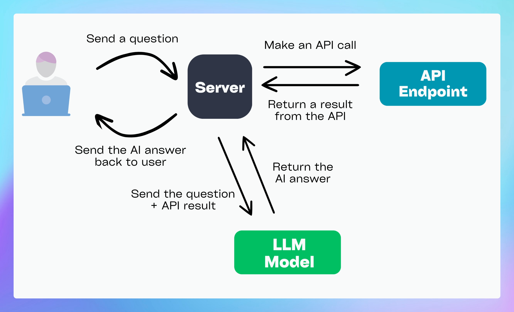

# Dynamic Context Use Cases

[TypingMind Dynamic Context](https://docs.typingmind.com/ai-agents/dynamic-context-via-api) allows AI models to access real-time data from external sources, thus making responses more accurate, relevant, and up to date. 

Instead of relying solely on pre-trained knowledge of the AI model, AI can fetch information from APIs to provide users with the latest details on various topics such as weather, movies, exchange rates, and job listings.

## **How it works**

The process of integrating dynamic context follows a **step-by-step** workflow:

1. **User Asks a Question**
- Example: *"What’s the weather like in New York?"*

1. **AI Agent Triggers an API Call**
- The AI sends a request to an external API (e.g., OpenWeather API).
- Request contains parameters like location and date.

**3. API Responds with Data**

- API sends back the current temperature, humidity, and conditions.

1. **AI Agent Merges API Data with User Query**
- The AI **interprets** the API response and **formats it into a natural answer**.

1. **AI Returns Answer to User**
- The final answer **combines AI-generated text + real-time data** for accuracy.
- Example Response: *"The current temperature in New York is 75°F with clear skies."*



## **Why use Dynamic Context?**

Compared to [**the knowledge base (TypingMind Custom**](https://docs.typingmind.com/typingmind-custom/branding-and-customizations/how-knowledge-base-works-in-typingmind-custom)), the Dynamic Context will inject the content directly into the system instruction. This means the AI will not need to perform a lookup in order to get the desired content.

- **Pros:** The AI has access to the context at all times in full and no delay.
- **Cons:** More context length will be used.

## Set up basic information for your AI Agent

Before diving into specific use cases, you first need to create an AI Agent and set it up with some basic information:

1. Go to **TypingMind > AI Agents > Create AI Agent**
2. Enter a **name** for your agent and a **brief description** of its role.
3. Optionally, upload a **profile picture**.
4. Add **system instructions** to guide how the AI behaves.
5. Enable **"Override System Instructions"** to ensure the AI follows your instructions strictly.


1. Set up Dynamic Context for the AI agent

<aside>
💡

We use [RapidAPI](https://rapidapi.com/) to connect APIs with Dynamic Context in TypingMind, but you can use your own API as well.

- Go to Rapid API and sign up for an account
- Search for the API you want and connect. Below are some example use cases.
</aside>

### Use case 1: **Get Current Weather for your location using OpenWeather API**

Here’s an example of how to set up an API to retrieve the current weather for a specific location:

- Search for OpenWeather API —> Select Current Weather Endpoint
- Switch to the Params tab to enter the city you want to get the weather.


On TypingMind, click on Dynamic Context and enter the following details:

- **Context Name:** *Current Weather* (or another relevant name)
- **HTTP Method:** `GET`
- **Endpoint URL -** For example, for Ho Chi Minh City: [https://open-weather13.p.rapidapi.com/city/Ho Chi Minh city/EN](https://open-weather13.p.rapidapi.com/city/Ho%20Chi%20Minh%20city/EN)
- **Headers for API Request**

Include these headers in your API request:

```json
{
  "X-RapidAPI-Key": "your-rapid-api-key",
  "X-RapidAPI-Host": "open-weather13.p.rapidapi.com"
}
```

**Step 3: Test the Connection**

Test the API to ensure that the request works and returns the correct data.

**Step 4: Enable API Caching** *(Optional, but recommended)*

You can enable API caching to save on costs by reducing the number of requests.


Here’s how it works:


If you want to get weather forecast, you can do the same settings with the forecast endpoint.

### Use case 2: Get stock market news using YH Finance API

Here’s an example of how to set up an API to retrieve the current stock market news:

- Search for YH Finance API —> Select Market News endpoint (v1)
- Switch to the Params tab to enter the tickers you want to view (optional)


On TypingMind, click on Dynamic Context and enter the following details:

- **Context Name:** Search Stock Market News (or another relevant name)
- **HTTP Method:** `GET`
- **Endpoint URL -** [https://yahoo-finance15.p.rapidapi.com/api/v1/markets/news](https://yahoo-finance15.p.rapidapi.com/api/v1/markets/news)
- **Headers for API Request**

Include these headers in your API request:

```json
{
  "X-RapidAPI-Key": "your-rapid-api-key",
  "X-RapidAPI-Host": "yahoo-finance15.p.rapidapi.com"
}
```

**Step 3: Test the Connection**

Test the API to ensure that the request works and returns the correct data.

**Step 4: Enable API Caching** *(Optional, but recommended)*

You can enable API caching to save on costs by reducing the number of requests.


Here’s how it works:


### Use case 3: Search jobs using JSearch API

Here’s an example of how to set up an API to retrieve the latest jobs in your industry:

- Search for JSearch API —> Select Job Search endpoint
- Switch to the Params tab to enter the query to search for your jobs, for example, marketing jobs in vietnam


On TypingMind, click on Dynamic Context and enter the following details:

- **Context Name:** Job Search (or another relevant name)
- **HTTP Method:** `GET`
- **Endpoint URL -** For example, for marketing jobs in Vietnam: 
`https://jsearch.p.rapidapi.com/search?query=marketing%20jobs%20in%20vietnam&page=1&num_pages=5&country=vn&date_posted=all`
- **Headers for API Request**

Include these headers in your API request:

```json
{
  "X-RapidAPI-Key": "your-rapid-api-key",
  "X-RapidAPI-Host": "jsearch.p.rapidapi.com"
}
```

**Step 3: Test the Connection**

Test the API to ensure that the request works and returns the correct data.

**Step 4: Enable API Caching** *(Optional, but recommended)*

You can enable API caching to save on costs by reducing the number of requests.


Here’s how it works:


## Useful tips

Upload your training files to let the AI get more domain-specific information to combine with the data from API to provide more personalized answers.

## Final thought

Please note that the use cases above are just a starting point. You can further enhance your AI capabilities by connecting to:

- Your own RAG database for domain-specific responses
- Other external APIs for real-time data retrieval
- Third-party services like Google Search API or social media data feeds to provide up-to-date content

Dynamic context enhances AI by integrating real-time data sources, making responses more **accurate, useful, and timely**. Try now on TypingMind!