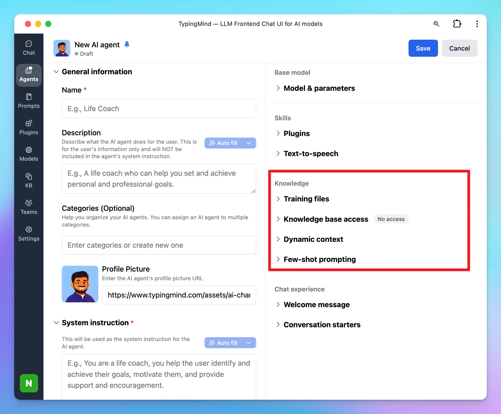

When building a custom AI Agent for your business or product, one of the most critical steps is training it with your **domain-specific knowledge**. Whether that’s product documentation, internal SOPs, support guides, or live system data—your Agent needs access to the right information to give accurate and helpful responses.

There are four main ways to provide knowledge to your Agent in TypingMind:

## 1. Upload Training Files Directly to the Agent

You upload documents directly into the Agent settings. The system extracts all the text and embeds it into the Agent’s system instructions.

This method consumes the context window (token limit) of the model you’ve chosen.

**Pros:**

- The Agent has full, fixed awareness of the uploaded text on every request.
- Simple and quick to set up.

**Cons:**

- Limited by the model’s token capacity (context limit).
- If the total text exceeds the model’s token limit, you can not upload the document

**Cost:**

- No charge for training characters.
- You pay only the standard API token cost for each request.

**Best use cases:**

Small, important files like FAQs, intros, disclaimers, or policy highlights.

## 2. Use a Knowledge Base (KB)

A Knowledge Base allows you to upload and manage larger sets of documents. The system processes and indexes your content so the Agent can retrieve relevant parts on demand using retrieval-augmented generation (RAG).

Unlike direct upload, the entire document is not loaded into context. Only relevant parts are dynamically injected, saving context space and making it more scalable for large content sets.

**Pros:**

- Efficient with large volumes of data.
- Agent retrieves only the most relevant content per query, reducing token usage.
- Easier to update and manage documents over time.

**Cons:**

- Retrieval is chunk-based, so nuanced or highly contextual information might not always be captured unless the query is specific.

**Cost:**

- Charged based on the number of training characters uploaded.
- Standard token-based API costs apply during Agent use.

**Best use cases:**

FAQs, help centers, product manuals, and other structured, referenceable content.

## 3. Inject Live Data with Dynamic Context

Dynamic Context allows your Agent to fetch and insert live data at runtime—from APIs, databases, or system variables.

Like direct upload, this also uses the model’s context window—but instead of static text, it injects fresh or user-specific content dynamically on each request.

**Pros:**

- Supports dynamic, personalized responses with up-to-date information.
- No need to manually upload or update documents.

**Cons:**

- Requires configuration of API endpoints, data mapping, and testing.
- Depends on the availability and performance of external data sources.
- Data is still limited by the model’s token context per response.

**Cost:**

- Standard API token costs per request.
- Any external service/API costs are billed separately.

**Best use cases:**

Live data, CRM data, user dashboards.

## 4. Build a Custom Plugin

Custom plugins give you full control over how your Agent fetches and processes data. You can connect to external systems, run business logic, or trigger workflows.

Plugins don’t rely on static document context or KB indexing. They actively retrieve and process data at runtime, injecting results into the model’s prompt only when needed.

**Pros:**

- Maximum flexibility and customization.
- Supports real-time actions, secure data access, or complex operations.

**Cons:**

- Requires developer time and technical expertise.
- Higher complexity in setup and maintenance.

**Cost:**

- API token costs per plugin invocation.
- Additional charges may apply for third-party APIs or services used.

**Best use cases:**

Advanced use cases like booking, internal tools integration, data-driven logic, or secure database queries.

## Comparison Overview

| Method | Best For | Scalable | Real-Time | Cost Model |
| --- | --- | --- | --- | --- |
| Direct Upload | Essential small documents | No | No | Token usage per request |
| Knowledge Base | Structured and reusable knowledge | Yes | No | Training characters \+ tokens |
| Dynamic Context | Live, dynamic, or user-specific data | Partial | Yes | Tokens \+ external API |
| Custom Plugin | Full control and advanced logic | Yes | Yes | Tokens \+ external API |

## Final Notes

To get the best results, many teams use a **hybrid approach**. For example:

- Upload key FAQs directly into the Agent.
- Store core documentation in the Knowledge Base.
- Use Dynamic Context or Plugins for live data like customer records or pricing.

Choosing the right combination depends on your data, use case, and how dynamic the information needs to be. The more relevant and structured your knowledge input, the more capable your AI Agent will be.