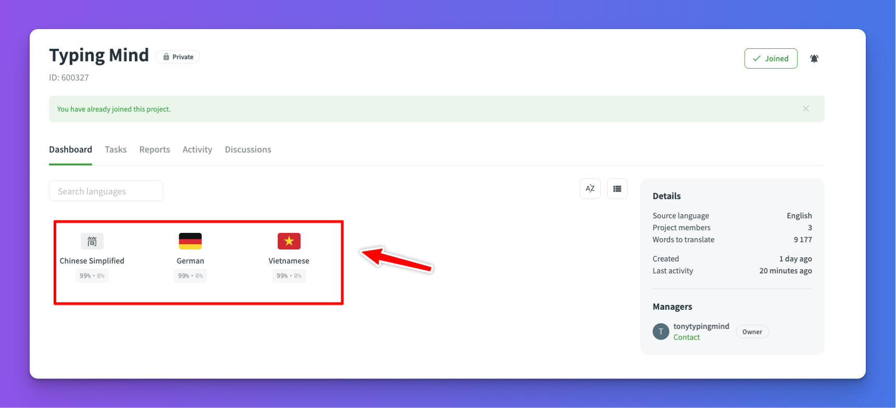

The collaboration process will be done via [https://crowdin.com/](https://crowdin.com/)

## Join crowdin

To join TypingMind on Crowdin, please follow these steps:

1. Send an email to **`support@typingmind.com`**, specifying the language you intend to translate
2. Our team will invite you to TypingMind Crowdin via email
3. Accept the invitation 

After joining Crowin, do as follows:

1.  Choose the language you want to add translation.

<aside>
💡 If the language you're interested in translating is not currently available, please let us know so we can assist in adding it.

</aside>



1. Choose messages.po


1. Enter your translation on each string and wait for the approval. 


## Important notes

To ensure a smooth collaboration process, please consider the following important points while translating:

### Keep the translated text the same length as the original text

This is to ensure it doesn’t break the UI layout when displayed on the app. 

For example, the text “*Disabled*” when translated to Vietnamese, “*Đã tắt*” and “*Đã bị vô hiệu hóa*” both have the same meaning, but “*Đã tắt*” is preferred instead of “*Đã bị vô hiệu hóa*” because it has roughly the same amount of characters, and displayed with the same size on the app UI.

### Avoid translating key technical terms and brand name

Don’t translate the technical terms and brand names when you find it suitable. For example: TypingMind (brand name, don’t translate), prompts, etc. 

Check out below for more cases:

### Handle variables, syntax, plurality, etc. in the translated text

1. **Keep variables in translation messages**

```
Handler for function {name} not found.
```

{name} is a variable in this translation, it must be kept as the original, only translate other words

For example, it should be translated like this: `Hàm xử lý cho hàm {name} không tìm thấy`

1. **Keep component syntax in translation messages**

```
Make sure you have your billing info added in <0>OpenAI Billing</0> page:
```

Basically, `<0>OpenAI Billing</0>` is a link, if you delete `<0>` and `</0>`, it will be no longer a link.

The translated text should be like this:

`Đảm bảo bạn đã thêm thông tin thanh toán ở trang <0>Thanh toán của OpenAI</0>`

1. **Singular, plural form**

```
{0, plural, one {# chat} other {# chats}}
```

This is a plural message, you only need to translate the words in `{ }` after `one` and `other`, the `#` symbol represents the number, so just keep it.

The proper translation might be:

```
{0, plural, one {# hội thoại } other {# hội thoại}}
```

If your language has more than “one” and “other” plural forms, you can translate the message and add some forms like this:

```
{0, plural, =0 {# hội thoại} one {# hội thoại } few {# hội thoại} many {# hội thoại} other {# hội thoại}}
```