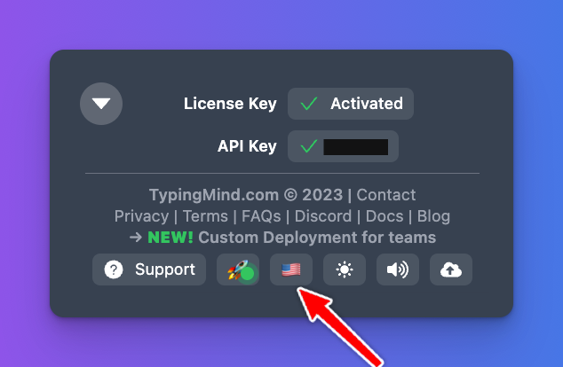

# Translation collaboration

We are working on support multi-language on [TypingMind.com](http://TypingMind.com).

If you can help with translation, please contact **support@typingmind.com** and we’ll share more details.

## Collab Process

- Translations are done via the online service [https://crowdin.com](https://crowdin.com)
- All translation texts are auto-translated when it first created using OpenAI (ChatGPT) translation. It can be inaccurate or sometimes completely unrelated.
- Translating is an on going process, not a one-time task. New features and changes are made to [TypingMind.com](http://TypingMind.com) every week. Crowdin will automatically notify you of new translations everytime there is a new update for the app.

## Guidelines

- Please try to keep the translated text the same length as the original text. This is to ensure it doesn’t break the UI layout when displayed on the app. For example, the text “*Disabled*” when translated to Vietnamese, “*Đã tắt*” and “*Đã bị vô hiệu hóa*” both have the same meaning, but “*Đã tắt*” is preferred instead of “*Đã bị vô hiệu hóa*” because it has roughly the same amount of characters, and displayed with the same size on the app UI.
- Avoid translating key technical terms and brand names where you seem fit. For example: TypingMind (brand name, don’t translate), prompts, etc.

Please check more detail: [Detail guidelines for TypingMind translation process](Set%20up%20Crowdin%20fa75452527aa4bb1b53e50e57ffc766e.md)

## Contribution Term

By contributing to the translation of TypingMind, you give us the full ownership of your work – the translated text – without any compensation. You forfeit the right to claim any compensation, royalty, or any kind of ownership on the translated content. The translated content will become the exclusive property of TypingMind, and you explicitly agree to relinquish any and all rights to the translated work. In addition, you acknowledge that TypingMind has the full authority to modify, alter, or utilize the translated content as it sees fit.