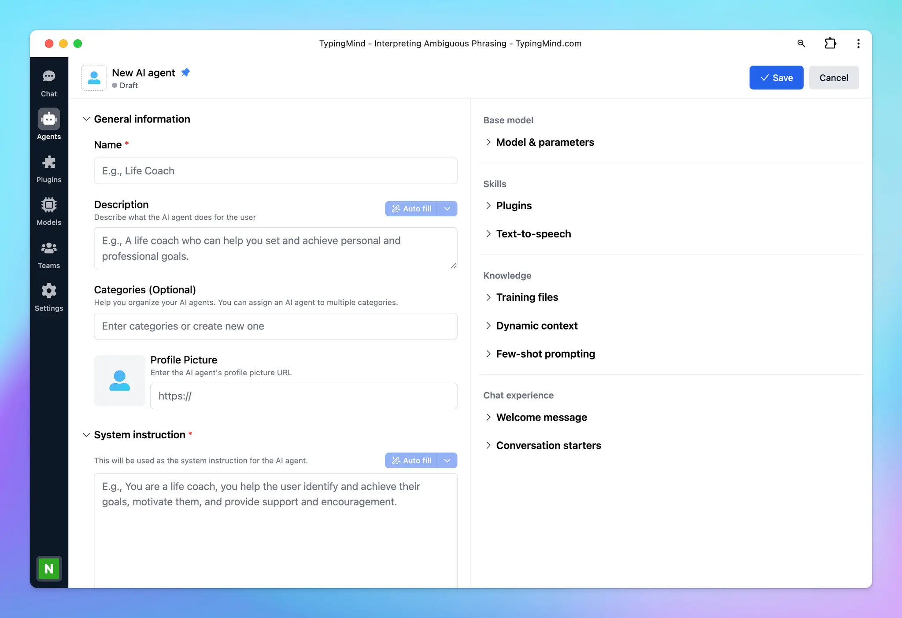

The release of Generative AI has been a game-changer for businesses, opening up new possibilities for automation and efficiency. Companies are now exploring how to adopt AI and integrate it into their operations to optimize workflows and achieve more with less effort.

One of the most advanced ways to harness the power of AI is by creating **multi-agent workflows**. This option leverages multiple specialized AI agents working together seamlessly to streamline processes, eliminate bottlenecks, and supercharge team productivity. 

By combining the strengths of individual AI agents into a single conversation, businesses can unlock unprecedented levels of efficiency and collaboration.

Let’s dive into more details!

## What are Multi-Agent Workflows?

**AI Agents** are specialized AI assistants that are built to handle specific tasks. Each agent is trained with a custom system prompt, custom training data, and a base AI model to perform its designated role effectively.

**Multi-Agent Workflows** take this a step further by combining several AI agents into one cohesive system. Each agent specializes in a particular function, such as scheduling, content creation, or data analysis, and they collaborate to complete tasks more efficiently.

Think of it as a team where each agent focuses on a particular task, such as scheduling, writing, or analyzing data. The agents communicate and work together to help you achieve specific tasks.

<aside>
💡

For example:

- **Agent 1**: Analyzes trends and provides insights.
- **Agent 2**: Handles marketing planning and strategy.
- **Agent 3**: Drafts content for blogs and social posts based on that plan
- **Agent 4**: Schedule and remind on tasks
</aside>

By delegating tasks to specialized AI agents, businesses can eliminate bottlenecks, improve accuracy, and accelerate their workflows.

However, building such workflows often requires significant time, resources, and technical expertise. This can be a barrier for many teams. 

Fortunately, [**TypingMind**](https://www.typingmind.com/?utm_source=blog&utm_medium=multi-agent) provides a no-code solution for creating and managing multi-agent workflows, make it accessible and easy to implement for everyone. Let’s see how it works via TypingMind.

## How to use Multi-Agent Workflows on TypingMind?

TypingMind simplifies creating and managing multi-agent workflows. Here’s how you can get started:

### Step 1: Build an AI Agent

You can start by creating a new AI Agent on TypingMind:

- Provide custom system instruction to guide the AI Agent behavior.
- Assign a base model for the AI Agent to make sure you will get the optimized results from the most appropriate AI model.
- Set custom knowledge for the AI Agent so it can refer to your data when it receives a query.
- Set skills for the AI Agents with Plugins* and Text-to-speech

<aside>
💡

*The **TypingMind plugin** system allows you to extend the capabilities for your AI Agent beyond the normal text conversation.

It can help you:

- Access the internet
- Generate images from text
- Integrate with your internal system to perform task automation like Slack, Zapier, Todoist, and more.
    - Assigning tasks to teams in Slack.
    - Creating and managing to-do lists in Todoist.
    - Triggering workflows across apps via Zapier.

This integration allows you to manage everything from within TypingMind so you don’t need to switch between platforms.

Please note that, to connect with your systems, you will need to build your own plugin if it’s not available on TypingMind yet.

***Our plugin system is very flexible. Learn more about [TypingMind Plugin System](../Plugins%20445c2cfdde7e41acb4e068e37234f2a3.md)***

</aside>



> Learn more on what you can do with AI Agent before bringing it into the workflow: https://docs.typingmind.com/ai-agents/ai-agents-overview
> 

### Step 2: Bring AI Agents into a workflow

Activating **Multi-Agent Workflows** for automation on TypingMind is simple and intuitive. Follow these steps below:

- **Start with an AI Agent:** in the message area, mention `@[AI_Agent_name]` followed by your prompt to begin interacting with a specific AI agent.
- **Add more Agents:** to bring additional AI agents into the workflow, use the syntax `---` (four dashes) to separate prompts for different agents.
- **Each agent jumps into the workflow** bringing its own settings you set for them in step 1 like AI models, parameters, and plugins to the table to allow you to create more powerful, automatic processes.

For example:

```json
Hi @[Market Researcher], could you please analyze the recent trends on remote work? Provide me some insights…

----

@[Marketing Planner], from the insights, please help prepare a content marketing plan for Q1, including blog posts and social posts. Break it down into a to-do list.

----

@[Marketing Assistant], can you help add these tasks to Todoist?

----

@[Content Writer], write the content for social posts in January. 

----

@[Marketing Assistant], can you help schedule these posts?
```

By sequencing the AI Agents like this, the system will automatically execute the tasks through the respective AI agents you mention:

- The “***Marketing Researcher***” agent will help you analyze the remote work trends and provide insights.
- Then the “***Marketing Planner***” will jump in to create a marketing plan based on the insights from “Marketing Researcher”
- After you get the content plan, you can ask the “***Marketing Assistant***” to break down those plans into small tasks and add those tasks to Todoist or Slack channel.
- The “***Content Writer***” agent will proceed with the detailed social post content in January.
- The “***Marketing Assistant***” agent is brought back to help schedule these posts via Zapier.

That’s how the Agent flow works, with no action needed from you!


[multiagent flow.mov](Build%20Multi-Agent%20Workflows/multiagent_flow.mov)

## Some practical use cases for Multi-Agent Workflows

Multi-Agent Workflows on TypingMind can change the way how businesses and individuals manage tasks, collaborate, and drive efficiency. Here are practical examples: 

### **1. Marketing campaign planning**

Managing a marketing campaign includes various moving parts, from ideation to execution. Multi-Agent Workflows can streamline this process:

- **Market Researcher:** gather insights on audience behavior, industry trends, and competitors.
- **Marketing Strategist:** develop a content marketing plan based on the research
- **Content Writer:** draft engaging copy for blogs, social posts, and newsletters.
- **Marketing Assistant:** schedule posts and tasks in project management tools like Todoist or Trello.

```json
Hi @[Market Researcher], could you please analyze the recent trends in sustainable fashion for 2024? Provide me some insights…

----

@[Marketing Strategist], based on the research insights, create a content marketing plan for Q1, including blog posts and social media posts. Break it down into actionable steps.

----

@[Marketing Assistant], can you add the to-do list to Todoist with deadlines and team assignments?

----

@[Content Writer], write a 500-word blog post on 'Top Trends in Sustainable Fashion' targeting millennials.

----

@[Marketing Assistant], schedule the blog post for publication next Monday and share it on LinkedIn and Instagram.
```

### **2. Project management and collaboration**

Large projects includes multiple stakeholders, deadlines, and deliverables. Multi-Agent Workflows help manage and coordinate effectively:

- **Task Allocator:** break down the project into tasks and assigns them to the right team members.
- **Timeline Coordinator:** set deadlines and monitors progress.
- **Risk Manager:** identify risks and suggests solutions.
- **Progress Reporter:** compile status updates and generates reports.*Example:* "Summarize the weekly progress report for the product launch."

```json
Hi @[Task Manager], create a project plan for the product launch, breaking it into tasks for design, marketing, and development teams. Assign initial deadlines.

----

@[Timeline Coordinator], update the timeline and highlight any critical dependencies between tasks.

----

@[Risk Analyst], review the project plan and flag potential risks that might delay the launch.

----

@[Progress Monitor], provide a weekly status report on the progress of the design and development teams.
```

### **3. Customer support**

Customer service is critical to business success. Multi-Agent Workflows can boost efficiency while maintaining a personalized touch:

- **Ticket Categorizer:** sort incoming inquiries into categories like technical issues, billing, or general questions.
- **Customer Analyst:** analyze customer queries to identify which aspects customers concern about most, which issues they are encountering.
- **Business Analyst :** break down the issues and concerns and assign to proper departments via Slack.

```json
Hi @[Ticket Categorizer], sort today’s incoming customer inquiries into categories such as Technical Issues, Billing, and General Questions. Provide me with an organized list.

----

@[Customer Analyst], analyze the sorted customer queries to identify the top concerns and recurring issues customers are facing. Summarize key insights.

----

@[Business Analyst], break down the identified issues and concerns into actionable tasks. Assign these tasks to the proper departments via Slack for resolution.
```

### **4. Financial Planning and Budgeting**

Managing finances is a common challenge for businesses and individuals. Multi-Agent Workflows can simplify this:

- **Expense Tracker:** categorize and summarizes spending trends
- **Budget Planner:** suggest adjustments based on spending patterns
- **Savings Advisor:** track progress toward financial goals and suggests improvements
- **Investment Monitor:** review and optimizes investment portfolios

```json
Hi @[Expense Tracker], analyze spending trends from the last quarter and categorize them into Marketing, Operations, and R&D.

----

@[Budget Planner], based on the expense analysis, suggest a quarterly budget allocation for each category.

----

@[Savings Advisor], create a plan to reserve 15% of the total budget as an emergency fund.

----

@[Investment Monitor], review the current investment portfolio and recommend rebalancing options for higher returns.
```

### **5. Content Creation and Distribution**

Producing and managing high-quality content can be time-consuming. Multi-Agent Workflows can streamline this process:

- **Trend Analyzer:** research trending topics and keywords
- **Content Creator:** write engaging articles, posts, or email campaigns.
- **SEO Specialist:** optimize content for search engines.
- **Scheduler:** publish content and sets reminders for updates.

```json
Hi @[Trend Analyzer], research trending topics related to AI-powered productivity tools for 2024. Summarize the findings.

----

@[Content Planner], draft a content calendar for the product launch, including blogs, emails, and social media posts.

----

@[SEO Specialist], suggest keyword optimizations for the blog titled 'How AI Can Boost Your Daily Productivity.'

----

@[Content Writer], draft the blog using the optimized keywords.

----

@[Social Media Assistant], schedule social media posts promoting the blog for LinkedIn, Twitter, and Instagram.
```