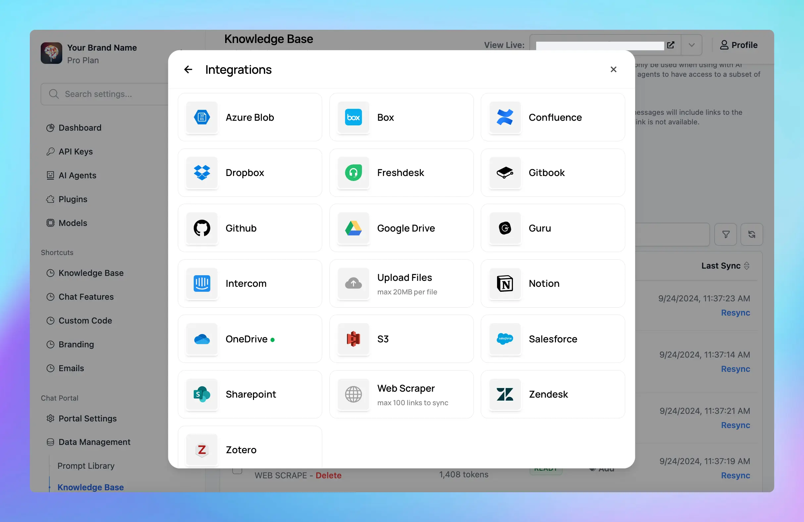

## 🔥 What’s new?

**New sources** have just been added to the knowledge base within your Admin Panel, including Freshdesk, GitHub, Salesforce, Zendesk, S3, Zotero, and more!

These new sources give you even more flexibility to connect and train your chatbot with data from your internal systems.

Learn more about [Knowledge base](https://custom.typingmind.com/features/upload-training-data)

### ✨ Stay updated

Follow us on [Twitter](https://x.com/TypingMindApp) to stay informed about the latest updates, tips, and tutorials.