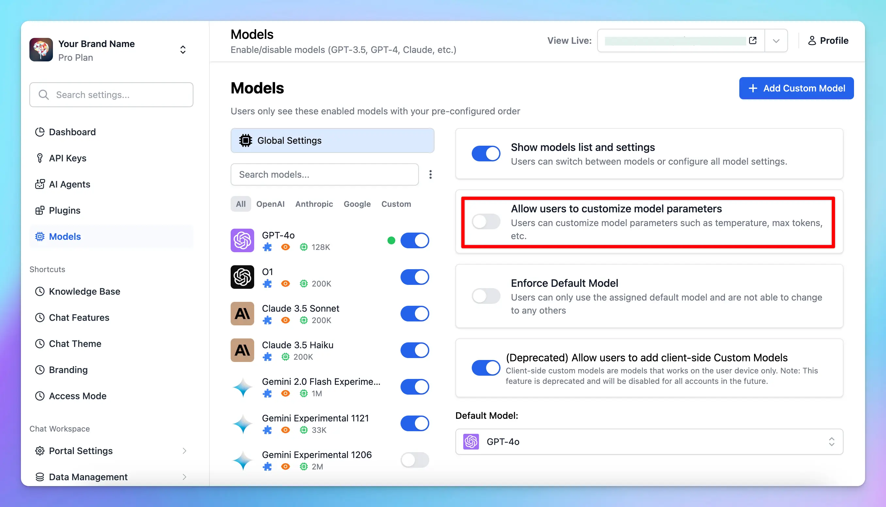

## 🔥 What’s new?

When this option is disabled, your users can only switch among models but can not adjust the custom parameters.

### ✨ Stay updated

Follow us on [X](https://x.com/TypingMindApp), [LinkedIn](https://www.linkedin.com/company/typingmind/), [Facebook](https://www.facebook.com/typingmind), [Instagram](https://www.instagram.com/typingmind_app/) to stay informed about the latest updates, tips, and tutorials.