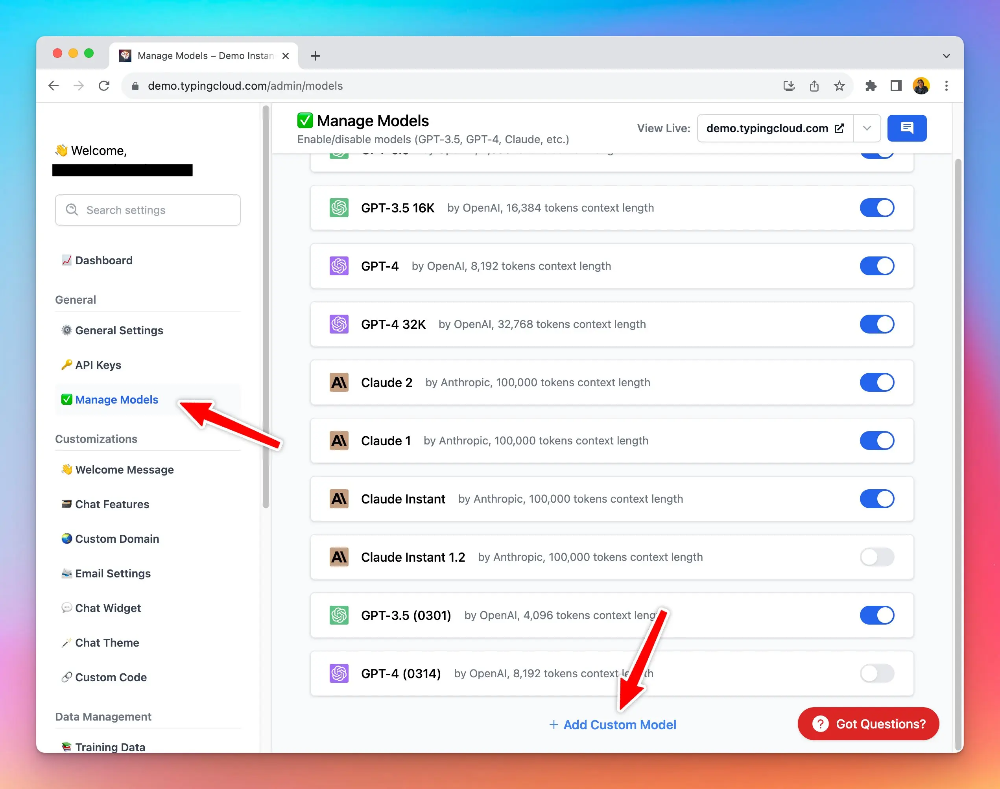

### **🚀 What's New?**

Typing Mind Custom now supports custom models.

You can connect your instance to open source LLMs, Azure OpenAI, Open Router models, or use your private LLM!

### ✨ Stay updated

Follow us on [Twitter](https://x.com/TypingMindApp) to stay informed about the latest updates, tips, and tutorials: 

[https://twitter.com/tdinh_me/status/1693463350750179598](https://twitter.com/tdinh_me/status/1693463350750179598)