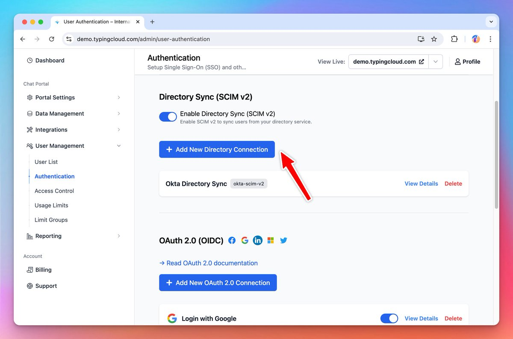

### **🚀 What's New?**

🔄Directory Sync (SCIM v2) is now available on [custom.typingmind.com](http://custom.typingmind.com/)

You can now sync users automatically from your team's identity providers (Okta, Azure Directory, etc.) to TypingMind along with SSO.

⇒ Read our document/guide here: https://docs.typingmind.com/typingmind-custom/user-management/setup-directory-sync-(scim-v2)

### ✨ Stay updated

Follow us on [Twitter](https://x.com/TypingMindApp) to stay informed about the latest updates, tips, and tutorials: 

[https://twitter.com/TypingMindApp/status/1830449821620048260](https://twitter.com/TypingMindApp/status/1830449821620048260)