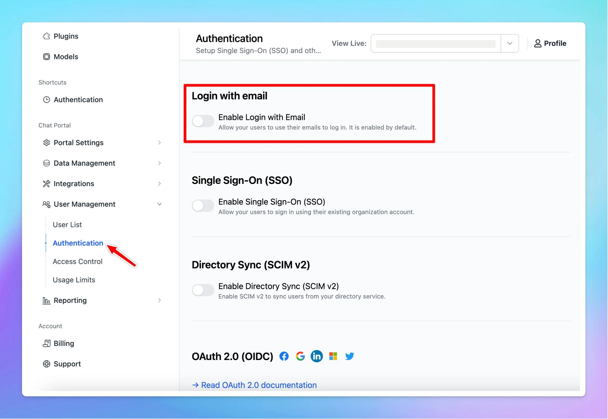

🔑You now have the option to enable or disable the Email Login for your members!

### **🚀 What's New?**

🔑You now have the option to enable or disable the Email Login for your members!

This way, your members can log in only through your preferred method, such as SSO or OAuth 2.0.

### ✨ Stay updated

Follow us on [Twitter](https://x.com/TypingMindApp) to stay informed about the latest updates, tips, and tutorials: 

[https://twitter.com/TypingMindApp/status/1841679819257401793](https://twitter.com/TypingMindApp/status/1841679819257401793)