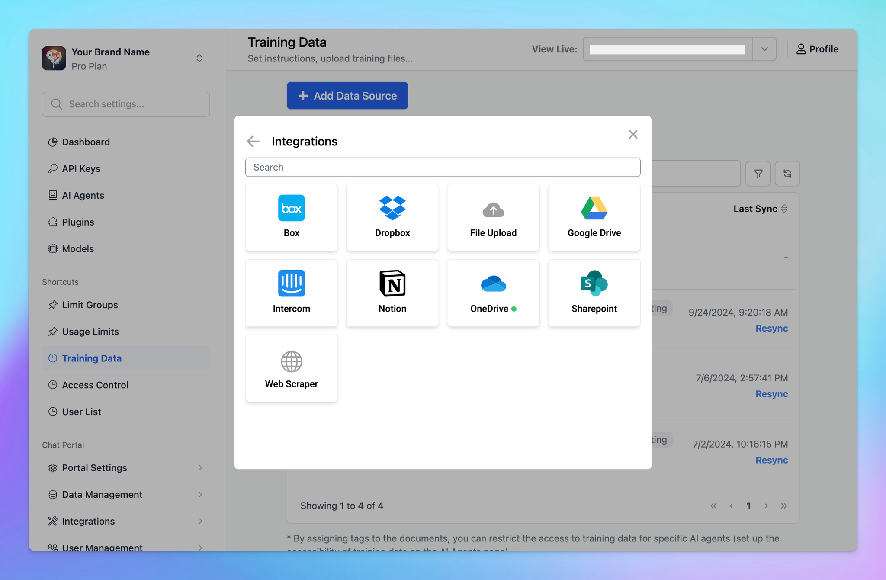

# Enable LLMs to cite sources

### **🚀 What's New?**

Enable LLMs to generate citations in their responses on [custom.typingmind.com](http://custom.typingmind.com/)!

By enabling "**Show reference sources of training documents to users"**, the AI model will provide a link to the source within your training document.

**🤔** Learn more here: https://docs.typingmind.com/typingmind-custom/branding-and-customizations/enable-llms-to-cite-sources-when-using-rag

### ✨ Stay updated

Follow us on [Twitter](https://x.com/TypingMindApp) to stay informed about the latest updates, tips, and tutorials: 

[https://twitter.com/TypingMindApp/status/1838526291861205265](https://twitter.com/TypingMindApp/status/1838526291861205265)