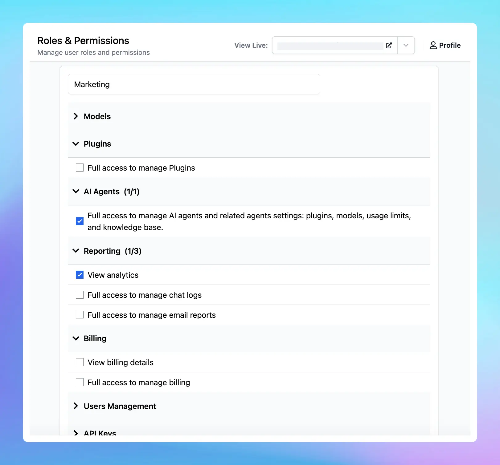

We are excited to share with your our new Roles and Permissions system - the advanced system that allows you to add team members to your chat instance, assign specific roles and permissions, and enable them to access the Admin Panel to support you in their designated functions.

## 🔥 What’s new?

Instance owners can create Custom Roles within each chat instance. You can define a variety of roles, each with a unique set of permissions, and then assign these roles directly to team members.

**TypingMind permissions** determine what actions each role can perform within the Admin Panel. These permissions are assigned to roles, not individual users.

Learn more: https://docs.typingmind.com/typingmind-custom/user-management/roles-and-permissions-101

### ✨ Stay updated

Follow us on [Twitter](https://x.com/TypingMindApp) to stay informed about the latest updates, tips, and tutorials.