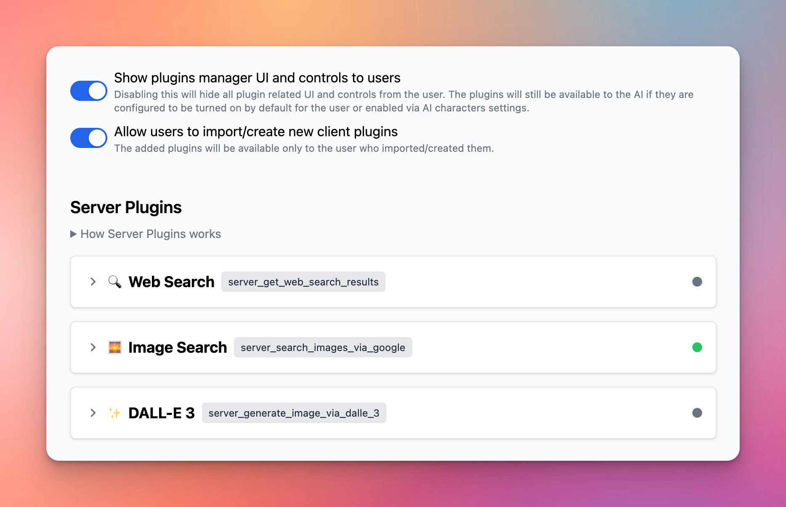

# Introducing Server Plugins

### **🚀 What's New?**

✨ Introducing Server Plugins on [custom.typingmind.com](http://custom.typingmind.com/)

Server plugins are plugins that:

- Run on the server side
- Are hidden away from the users.

This allows Admins to enable and set up the plugin settings in advance, so your users just need to use them and don’t need to provide any plugin settings.

As a result, your plugin source code, settings, credentials, etc.,  will not be exposed to users, ensuring a seamless user experience.

### ✨ Stay updated

Follow us on [Twitter](https://x.com/TypingMindApp) to stay informed about the latest updates, tips, and tutorials: 

[https://twitter.com/TypingMindApp/status/1780231033499128125](https://twitter.com/TypingMindApp/status/1780231033499128125)