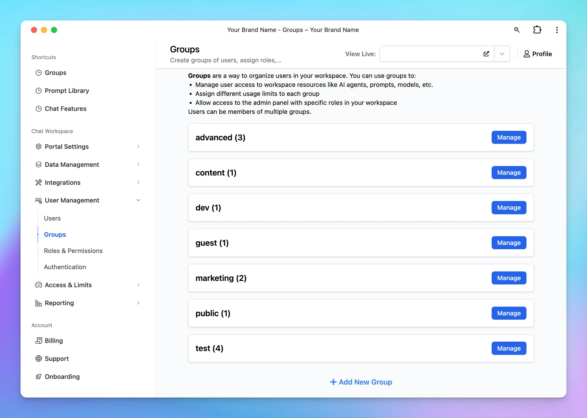

## 🔥 What’s new?

TypingMind User Group is an enhanced version of TypingMind’s user tags at [custom.typingmind.com](http://custom.typingmind.com/).

User Groups allow you to organize your invited users into different categories or teams, called groups. These groups can then be used to:

✅ Manage resource access: control which AI agents, prompts, and AI models should be available to each group.
✅ Set usage limits: assign specific limits, such as model usage and the number of messages a group can send, to manage your resources and cost better.

You can also enable Admin Panel access with custom roles and permissions for each user group.

**Learn more:** https://docs.typingmind.com/typingmind-custom/user-management/create-and-manage-user-groups

### ✨ Stay updated

Follow us on [X](https://x.com/TypingMindApp), [LinkedIn](https://www.linkedin.com/company/typingmind/), [Facebook](https://www.facebook.com/typingmind), [Instagram](https://www.instagram.com/typingmind_app/) to stay informed about the latest updates, tips, and tutorials.

[https://x.com/TypingMindApp/status/1871586749140611417](https://x.com/TypingMindApp/status/1871586749140611417)