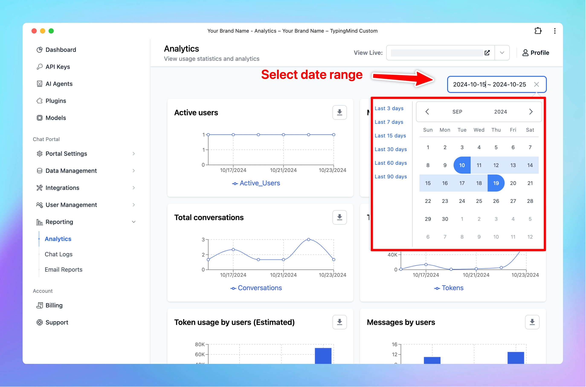

New updates for Analytics Page on [custom.typingmind.com](http://custom.typingmind.com/)!

### **🚀 What's New?**

With this update, you can:

✅ Select custom date range to view reports.
✅ Export data to CSV within a selected period

### **🤔 Why This Matters**

This allows you to optimize your reports for precise analysis and easily compare data across various timeframes to identify…

### ✨ Stay updated

Follow us on [Twitter](https://x.com/TypingMindApp) to stay informed about the latest updates, tips, and tutorials: 

[https://twitter.com/TypingMindApp/status/1849675726695616570](https://twitter.com/TypingMindApp/status/1849675726695616570)