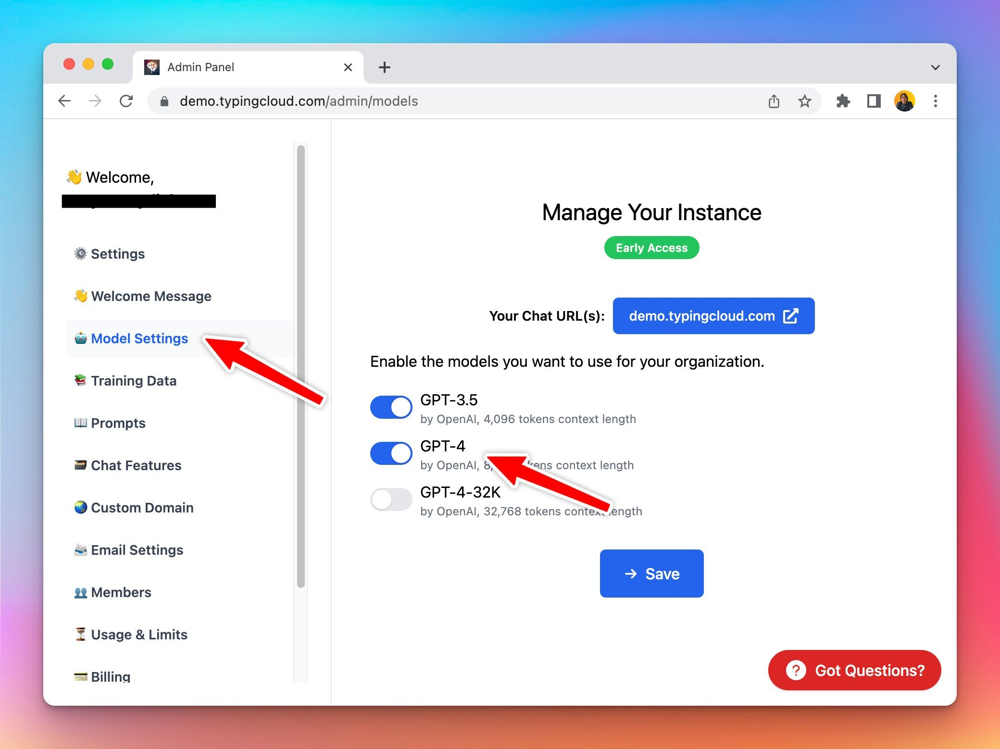

### **🚀 What's New?**

You can now select which model to enable for your users in Typing Mind Custom Deployment: [https://typingmind.com/custom](https://typingmind.com/custom)

### ✨ Stay updated

Follow us on [Twitter](https://x.com/TypingMindApp) to stay informed about the latest updates, tips, and tutorials: 

[https://x.com/TypingMindApp/status/1664093146802683905](https://x.com/TypingMindApp/status/1664093146802683905)