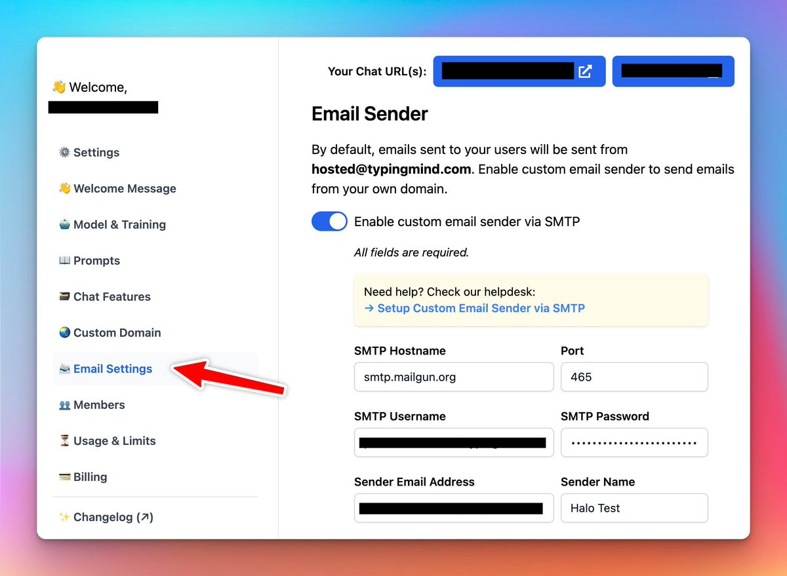

### **🚀 What's New?**

Custom Deployment now supports sending emails using your own SMTP config 😄

This will help create a better branded experience for the users.

### ✨ Stay updated

Follow us on [Twitter](https://x.com/TypingMindApp) to stay informed about the latest updates, tips, and tutorials: 

[https://x.com/TypingMindApp/status/1658928508310114308](https://x.com/TypingMindApp/status/1658928508310114308)