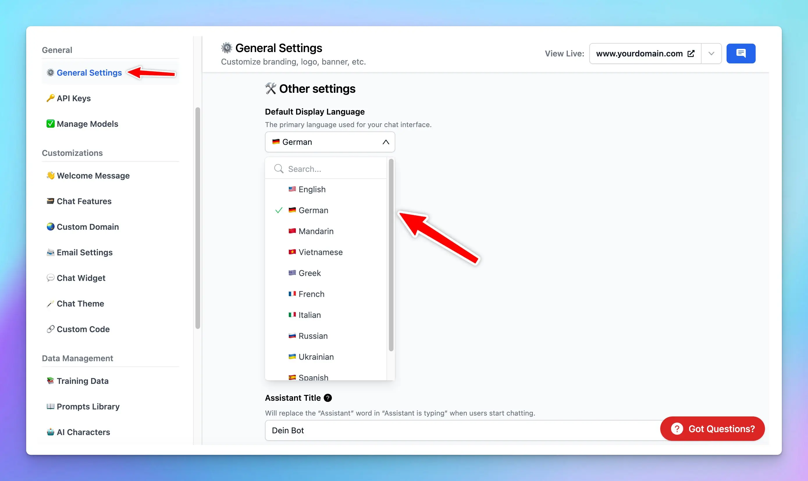

### **🚀 What's New?**

🌍 Customize the chat UI in your preferred language!

Admins now have the option to set the default language for your chat interface.

Check it out: [custom.typingmind.com](http://custom.typingmind.com/)

### ✨ Stay updated

Follow us on [Twitter](https://x.com/TypingMindApp) to stay informed about the latest updates, tips, and tutorials: 

[https://twitter.com/TypingMindApp/status/1698599700234924459](https://twitter.com/TypingMindApp/status/1698599700234924459)