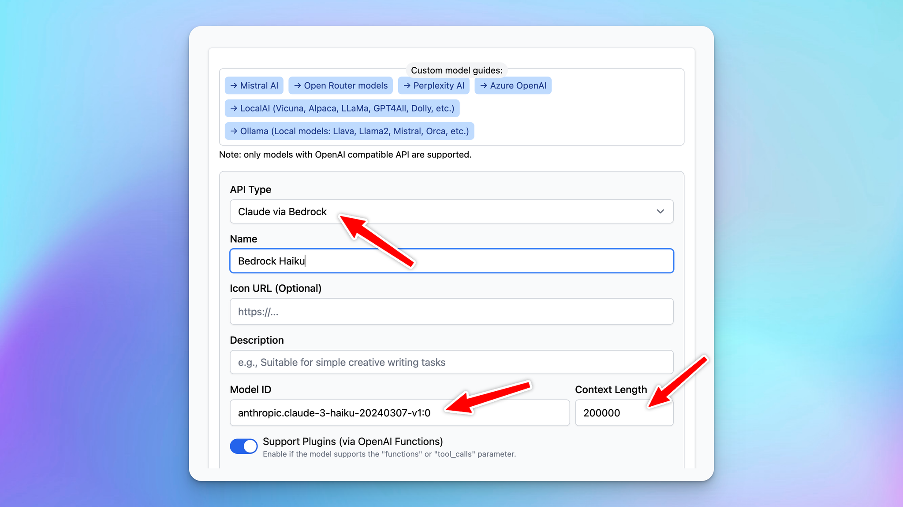

# Use AWS Bedrock Anthropic

We are thrilled to announce that you can now seamlessly integrate and deploy Anthropic AI models using **AWS Bedrock** directly within **TypingMind**! This powerful integration allows you to harness advanced AI capabilities to enhance your applications and workflows.

### **🚀 What's New?**

With this update, you can:

- **Easily Connect to Anthropic Models via AWS:** use the custom model option to create the AWS Anthropic models on TypingMind.
- **Scale Effortlessly with AWS:** Benefit from AWS's robust infrastructure to scale your AI solutions as your needs grow.
- **Secure and Compliant Deployment:** Utilize AWS's security features to keep your data protected and comply with industry standards.

### **🤔 Why This Matters**

Whether you're developing chatbots, virtual assistants, or any language-driven solution, this integration accelerates your development cycle and improves performance.

### **🏁 How it works**

To help you set up and start using this new option, we've prepared a comprehensive guide:

**🔗 [Use AWS Bedrock Anthropic](Use%20AWS%20Bedrock%20Anthropic%201387c3f1757a816cbd8cda2a99fecf88.md)**

Set up Claude via Bedrock on TypingMind

### ✨ Stay updated

Follow us on [Twitter](https://x.com/TypingMindApp) to stay informed about the latest updates, tips, and tutorials: 

[https://x.com/TypingMindApp/status/1838799087161983113](https://x.com/TypingMindApp/status/1838799087161983113)