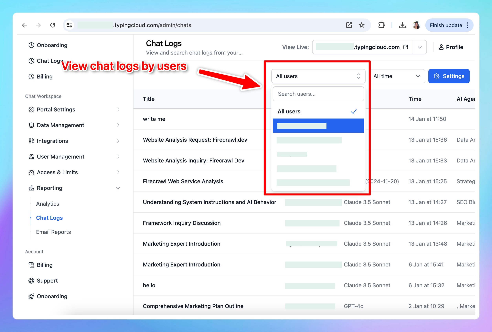

## 🔥 What’s new?

Easily access and review chat logs filtered by individual users.

This allows you to analyze and track user interaction more efficiently.

**Tip can also export chat logs via API**: https://docs.typingmind.com/typingmind-custom/integrations/export-chat-logs

### ✨ Stay updated

Follow us on [X](https://x.com/TypingMindApp), [LinkedIn](https://www.linkedin.com/company/typingmind/), [Facebook](https://www.facebook.com/typingmind), [Instagram](https://www.instagram.com/typingmind_app/) to stay informed about the latest updates, tips, and tutorials.

[https://x.com/TypingMindApp/status/1882062410883756446](https://x.com/TypingMindApp/status/1882062410883756446)