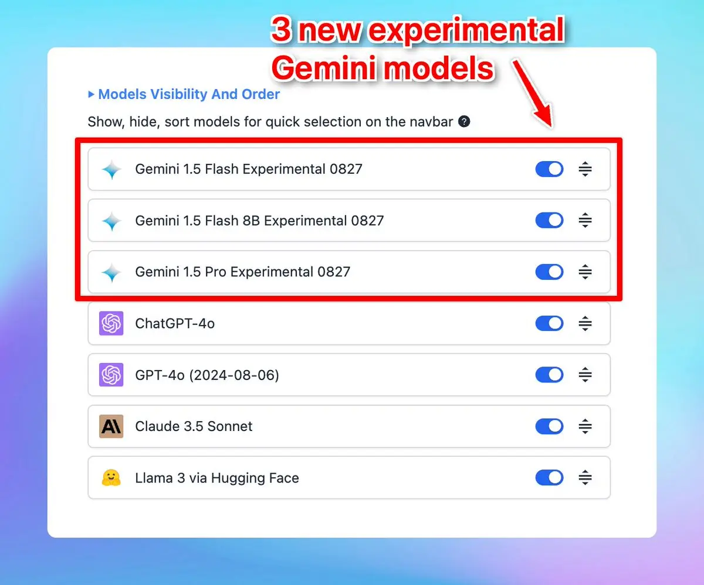

✅ New experimental Gemini models are now available on [typingmind.com](http://typingmind.com/)!

### **🚀 What's New?**

We have just updated 3 new experimental Gemini models on our platform:

- A new smaller variant, Gemini 1.5 Flash-8B
- A stronger Gemini 1.5 Pro Experimental 0827
- A significantly improved Gemini 1.5 Flash Experimental 0827

Easy access Google's Gemini AI models with [typingmind.com](http://typingmind.com): https://docs.typingmind.com/chat-models-settings/use-with-gemini

### ✨ Stay updated:

Follow us on [Twitter](https://x.com/TypingMindApp) to stay informed about the latest updates, tips, and tutorials: 

[https://twitter.com/TypingMindApp/status/1829600004425859305](https://twitter.com/TypingMindApp/status/1829600004425859305)