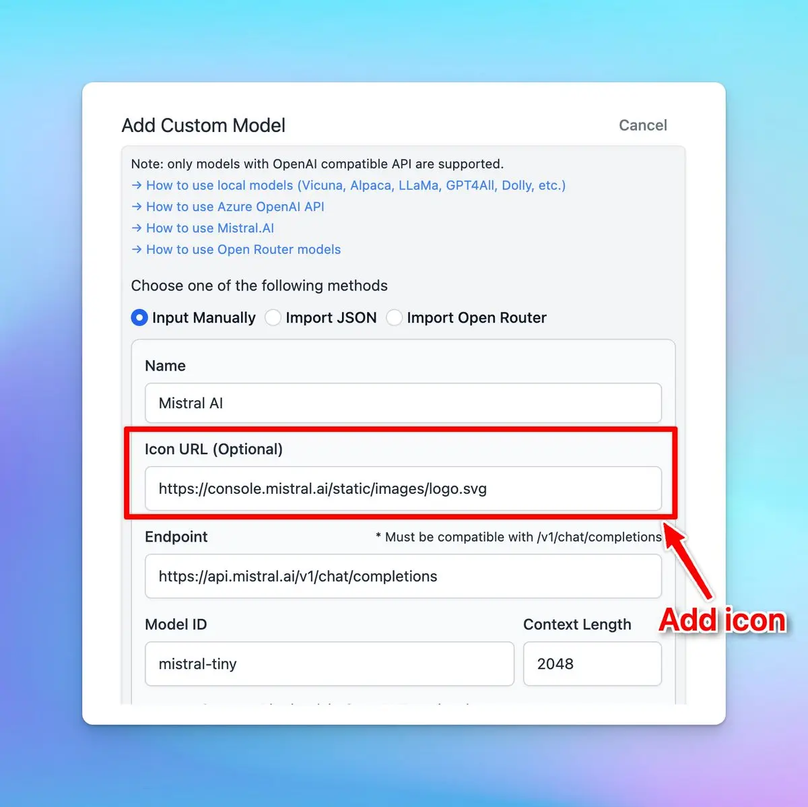

## **🚀 What's New?**

Add icon for your custom model by entering the icon URL while setting up the model.

## ✨ Stay updated

Follow us on [Twitter](https://x.com/TypingMindApp) to stay informed about the latest updates, tips, and tutorials: 

[https://twitter.com/TypingMindApp/status/1751086627215257613](https://twitter.com/TypingMindApp/status/1751086627215257613)