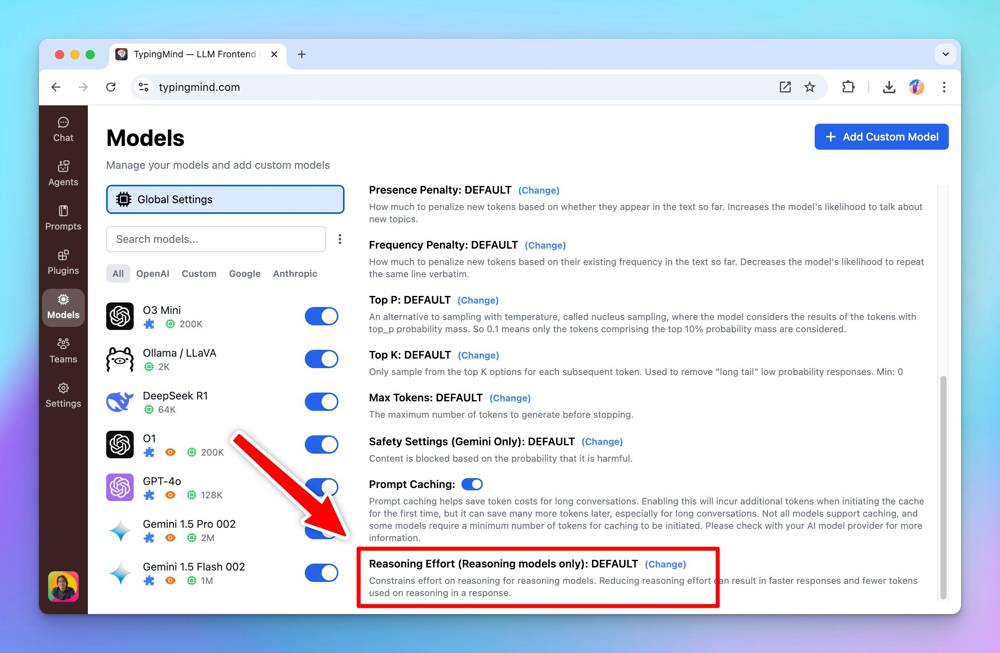

## 🔥 What’s new?

You can now select the reasoning effort from "low" to "high" for better output of the o3 models

## 📌 Stay updated

Follow us on [X](https://x.com/TypingMindApp), [LinkedIn](https://www.linkedin.com/company/typingmind/), [Facebook](https://www.facebook.com/typingmind), [Instagram](https://www.instagram.com/typingmind_app/) to stay informed about the latest updates, tips, and tutorials.

[https://x.com/TypingMindApp/status/1886429688270332063](https://x.com/TypingMindApp/status/1886429688270332063)