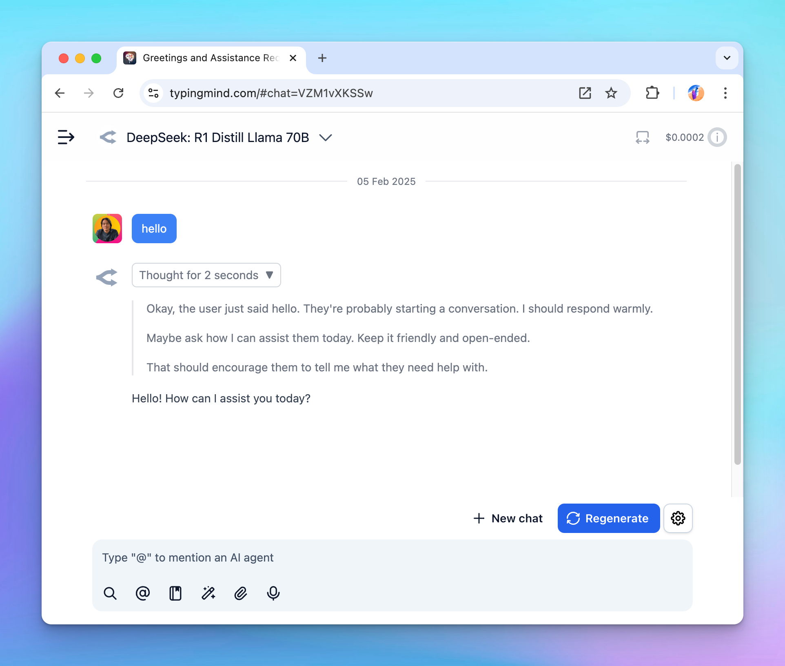

## 🔥 What’s new?

TypingMind now support rendering `<think>` tags from OpenRouter and Azure AI Foundry models!

Note: Open Router models does not show reasoning tokens by default, so you need to add the include_reasoning (boolean) = true for the custom model. This can be done when adding new models or by editting existing models.

## 📌 Stay updated

Follow us on [X](https://x.com/TypingMindApp), [LinkedIn](https://www.linkedin.com/company/typingmind/), [Facebook](https://www.facebook.com/typingmind), [Instagram](https://www.instagram.com/typingmind_app/) to stay informed about the latest updates, tips, and tutorials.