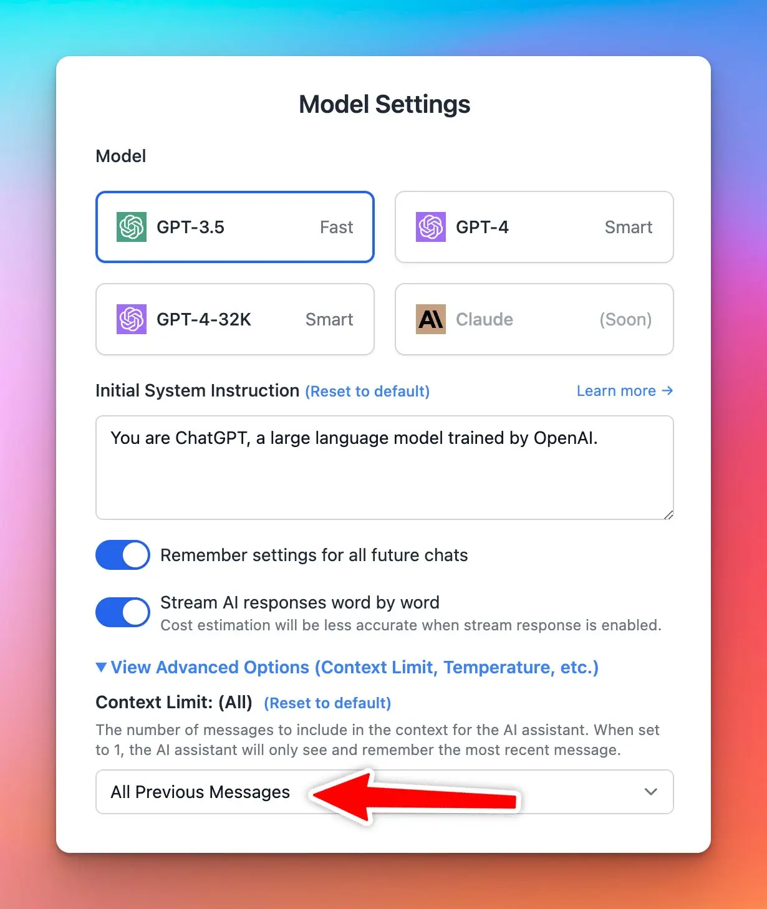

### **🚀 What's New?**

Added "Context Limit" to [typingmind.com](http://typingmind.com/). This will be helpful if you want to limit the amount of tokens usage. 

Also helpful if you want the assistant to be a "one-off question/answer machine" instead of having long conversations.

### ✨ Stay updated

Follow us on [Twitter](https://x.com/TypingMindApp) to stay informed about the latest updates, tips, and tutorials: 

[https://twitter.com/TypingMindApp/status/1658322694545494016](https://twitter.com/TypingMindApp/status/1658322694545494016)