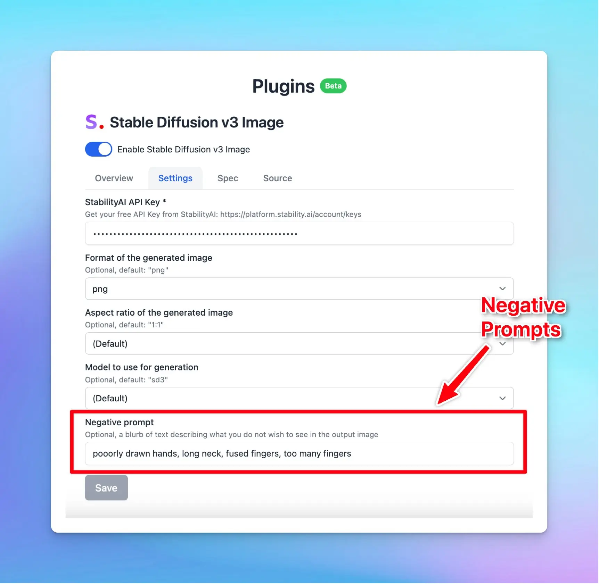

🧩 We’ve added "Negative Prompts" for Stable Diffusion v3 Image!

### **🚀 What's New?**

🛑 Added "Negative Prompts" for Stable Diffusion v3 Image!

Now you can specify what you don't want to see in the generated images.

### ✨ Stay updated

Follow us on [Twitter](https://x.com/TypingMindApp) to stay informed about the latest updates, tips, and tutorials: 

[https://twitter.com/TypingMindApp/status/1789877983366590780](https://twitter.com/TypingMindApp/status/1789877983366590780)