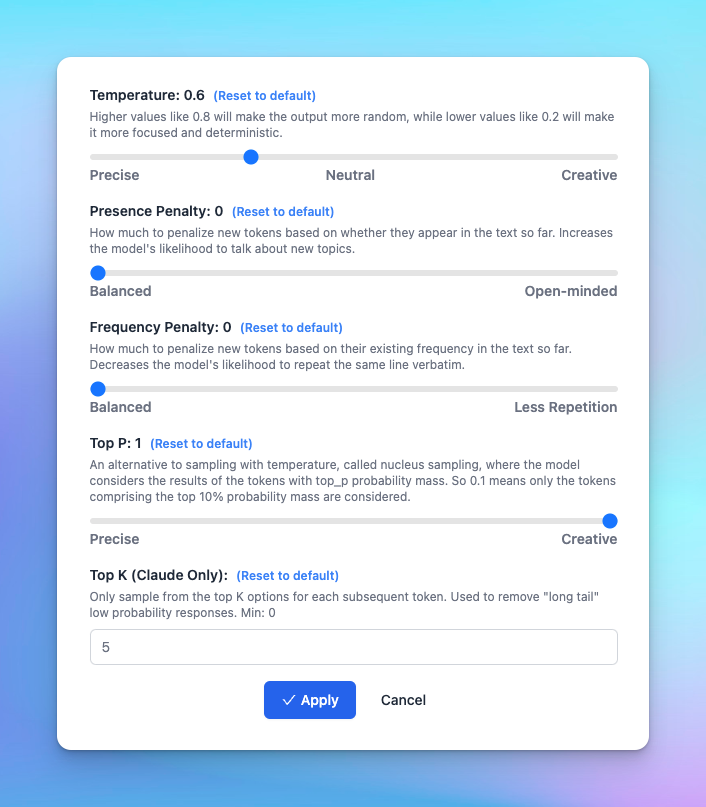

## **🚀 What's New?**

Added "Top K" parameter for Claude!

👉 Remove long tail low probability responses, essentially focusing the model's responses on the most likely outputs.

Learn more about TypingMind Parameters: https://docs.typingmind.com/parameter-settings/parameter-settings

## ✨ Stay updated

Follow us on [Twitter](https://x.com/TypingMindApp) to stay informed about the latest updates, tips, and tutorials:

[https://twitter.com/TypingMindApp/status/1706511913239334992](https://twitter.com/TypingMindApp/status/1706511913239334992)