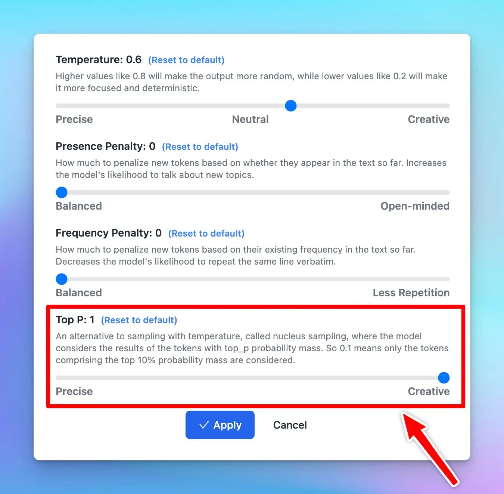

## **🚀 What's New?**

Adjust the top P parameter on TypingMind.

Top P is used to control the randomness of the AI's outputs, also known as nucleus sampling.

Basically, when the AI model is deciding what word to say next, it calculates a score for each possible word. It then uses these scores to decide which word to choose. Top P influences this selection process.

Learn more: https://docs.typingmind.com/parameter-settings/parameter-settings

## ✨ Stay updated

Follow us on [Twitter](https://x.com/TypingMindApp) to stay informed about the latest updates, tips, and tutorials:

[https://twitter.com/TypingMindApp/status/1697457440315339130](https://twitter.com/TypingMindApp/status/1697457440315339130)