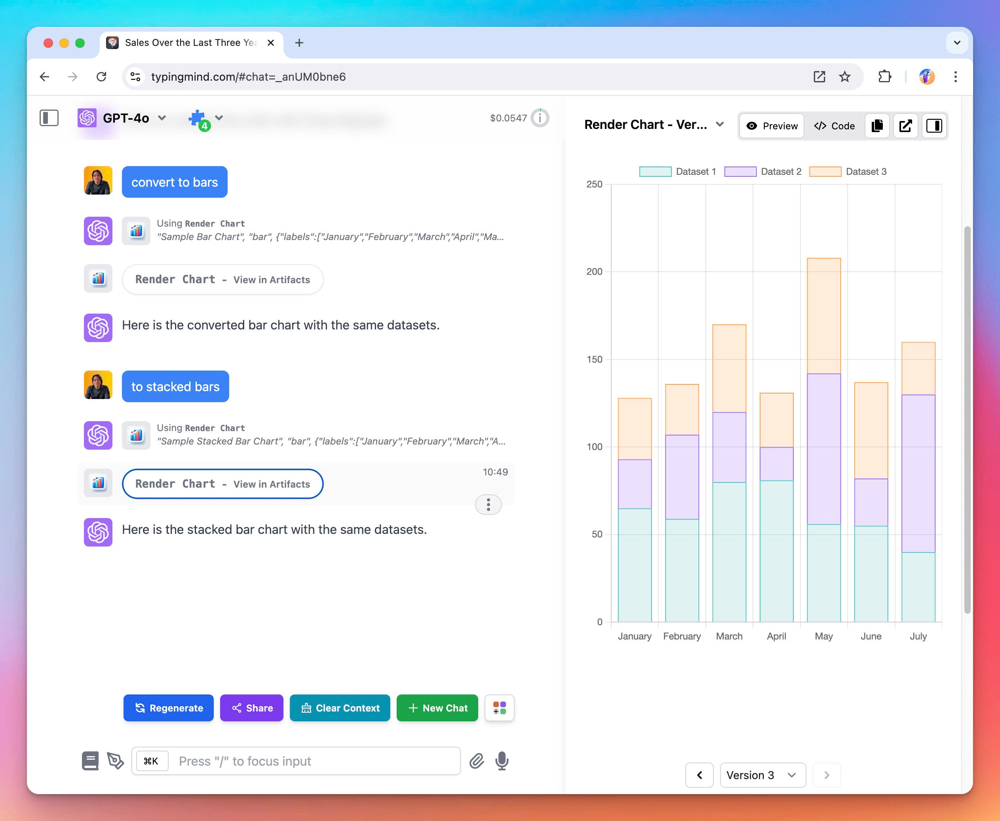

# Artifacts on TypingMind

✅ We have just implemented Artifacts in TypingMind - a new feature built to simplify and enhance your workflow!

### **🚀 What's New?**

TypingMind Artifacts are designed to seamlessly integrate with your existing workflow.

It is compatible with all plugins that render markdown or HTML. Also, by using Artifacts on TypingMind, you are not limited to just the Claude models but you can use with any models that support plugins.

### **🏁 How it works:**

Artifacts in TypingMind are automatically triggered for generating structured content (e.g., code, documents, data visualizations). Therefore, you do not need to manually start an Artifact; it appears when the context requires it.

The AI will automatically deploy relevant plugins (e.g., Interactive Canvas, Render Charts, Mermaid Diagram) to generate visual elements.

To help you clearly understand about TypingMind Artifacts, learn more: https://docs.typingmind.com/plugins/typingmind-artifacts

### ✨ Stay updated:

Follow us on [Twitter](https://x.com/TypingMindApp) to stay informed about the latest updates, tips, and tutorials: 

[https://x.com/TypingMindApp/status/1829047466781749737](https://x.com/TypingMindApp/status/1829047466781749737)