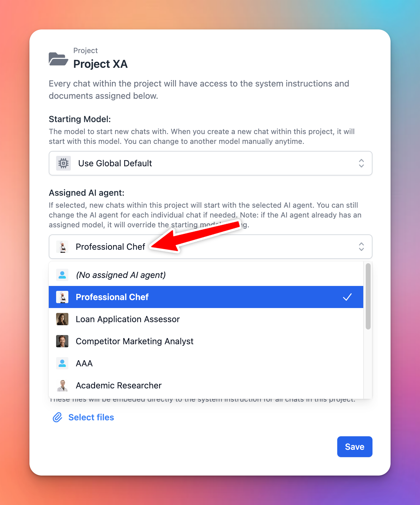

# Assign AI Agent to Project Folder

Now you can assign a specific AI Agent to your Project folder to enhance the productivity by minimizing the steps to select AI Agent within Project. 

## ⚙️ How it works?

- Click to open the Project folder settings
- Select an AI agent to assign to your project.

Once you select an AI Agent, new chats within that project will start with the selected AI agent. You can still change the AI agent for each individual chat if needed. 

Note: if the AI agent already has an assigned model, it will override the starting model setting.

## 📌 Stay updated

Follow us on [Twitter](https://x.com/TypingMindApp) to stay informed about the latest updates, tips, and tutorials.

[https://x.com/TypingMindApp/status/1854826193972826344](https://x.com/TypingMindApp/status/1854826193972826344)