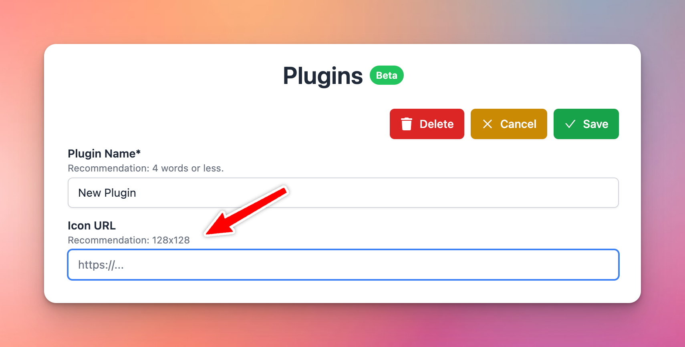

🧩 We’ve made a major improvement around the plugin system for plugin developers and Typing Mind Custom users!

### **🚀 What's New?**

We’ve made a major improvement around the plugin system for plugin developers and Typing Mind Custom users!

- **Added Icon URL**: you are no longer forced to use the “🧩” emoji as your plugin icon! Click “Edit”, then enter the Icon URL for your plugin, and it will be shown everywhere in the app.
- **Added HTTP Action:** this is a new way to implement your plugin without using JavaScript code. HTTP Action allows you to easily set up a simple HTTP request for external services. Post-processing engines (**JSMEPath** and **Handlebars.js**) are available to help you customize the output even more.
- **Added Output Options:** You can now render your plugin output directly to the user instead of giving the output to the AI models. The output can be rendered using **Markdown** or **HTML.** This gives you more flexibility to render interactive experiences to the users and, in some cases, saves more tokens!
- **JavaScript code changes:** The `__CUSTOM_OUTPUT` special property is now deprecated (replaced by the **Output Options** feature). If you have developed a plugin that uses this property in your JavaScript implementation, please update your plugins according to the new [Plugins documentation](https://docs.typingmind.com/plugins/build-a-typingmind-plugin) (just updated!).

Read newly update of plugin here: https://docs.typingmind.com/plugins/build-a-typingmind-plugin

### ✨ Stay updated

Follow us on [Twitter](https://x.com/TypingMindApp) to stay informed about the latest updates, tips, and tutorials: 

[https://twitter.com/TypingMindApp/status/1779904186794340511](https://twitter.com/TypingMindApp/status/1779904186794340511)