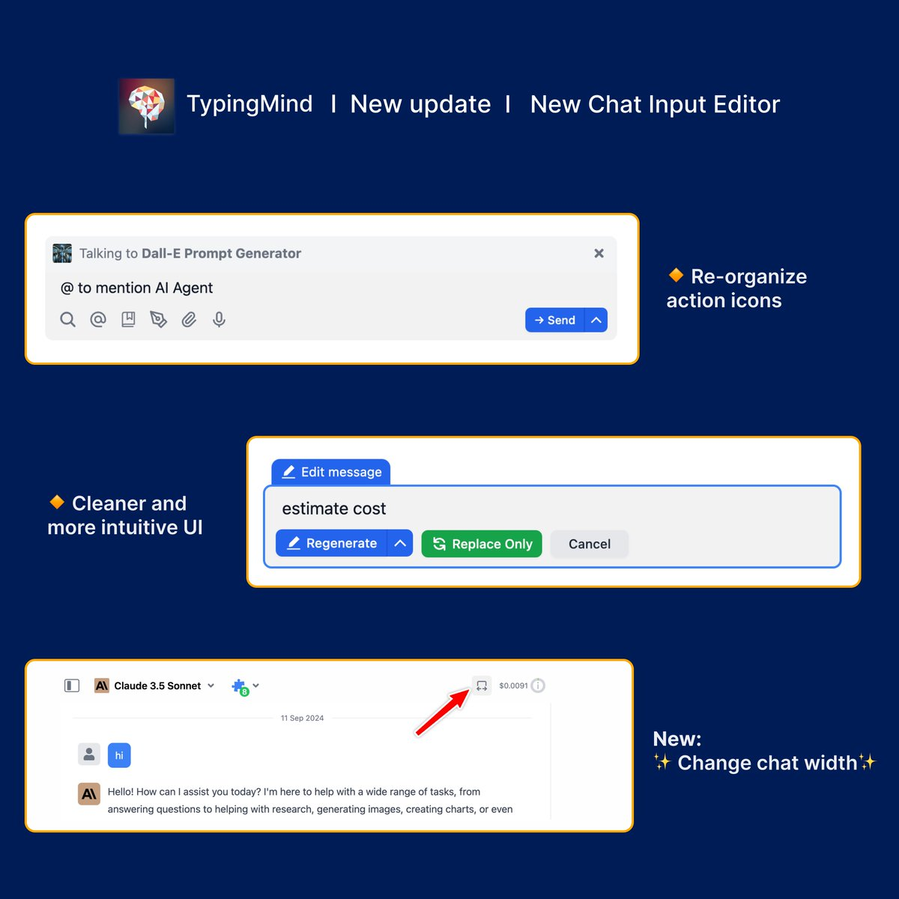

🧩 We’ve just improved UX/UI for the Chat Input Editor to bring you a better chat experience!

### **🚀 What's New?**

The new design is cleaner and more organized with:

- Reorganized action buttons/icons
- Added an option to adjust chat width.

➡️ Get started with TypingMind to get familiar with the interface: https://docs.typingmind.com/getting-started/get-started-with-typingmind

### ✨ Stay updated

Follow us on [Twitter](https://x.com/TypingMindApp) to stay informed about the latest updates, tips, and tutorials: 

[https://twitter.com/TypingMindApp/status/1833889990075732336](https://twitter.com/TypingMindApp/status/1833889990075732336)