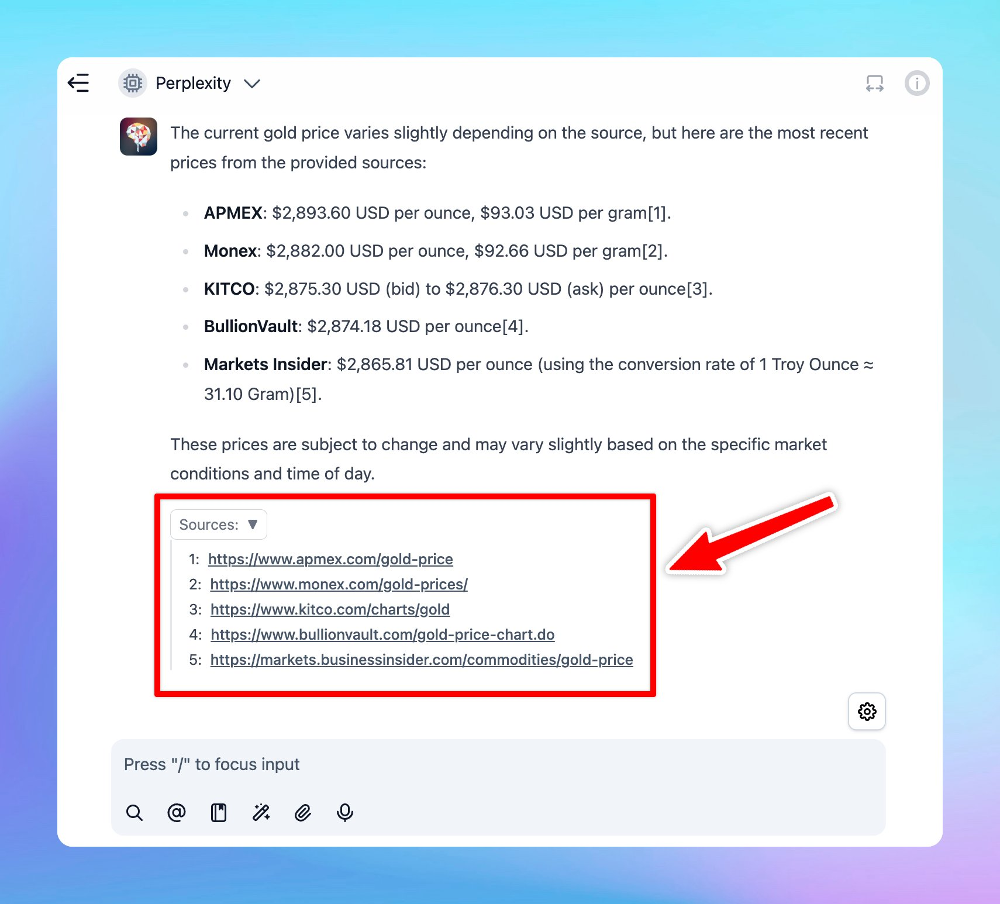

## 🔥 What’s new?

Now, when you set up Perplexity as a custom model on TypingMind, you can view the citations directly within the chat.

Learn how to set up the Perplexity model:

https://t.co/R7idQGh5lk

## 📌 Stay updated

Follow us on [X](https://x.com/TypingMindApp), [LinkedIn](https://www.linkedin.com/company/typingmind/), [Facebook](https://www.facebook.com/typingmind), [Instagram](https://www.instagram.com/typingmind_app/) to stay informed about the latest updates, tips, and tutorials.

[https://x.com/TypingMindApp/status/1888959356743434668](https://x.com/TypingMindApp/status/1888959356743434668)