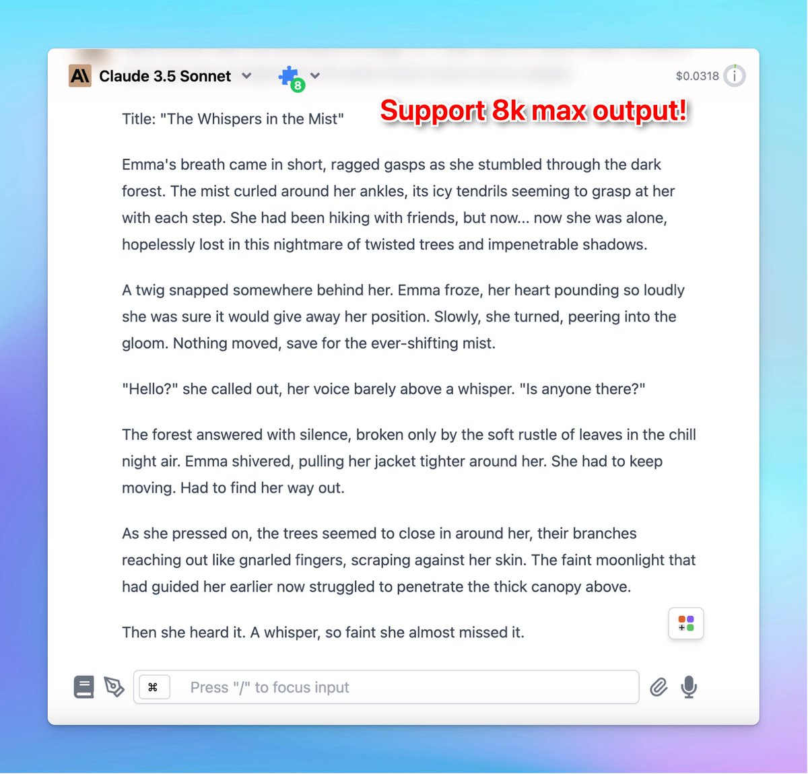

✅ Claude 3.5 Sonnet max output has been doubled!

### **🚀 What's New?**

Claude 3.5 Sonnet now has 8k max output. It updated from 4096 tokens to 8192 tokens.

### ****❓ **How To Use:**

Quick change the token limit of **Claude 3.5 Sonnet:**

- Go to Advanced Model Parameters > Set the Max tokens limit to 8192.

### ✨ Stay updated:

Follow us on [Twitter](https://x.com/TypingMindApp) to stay informed about the latest updates, tips, and tutor:

[https://twitter.com/TypingMindApp/status/1813415578519880028](https://twitter.com/TypingMindApp/status/1813415578519880028)