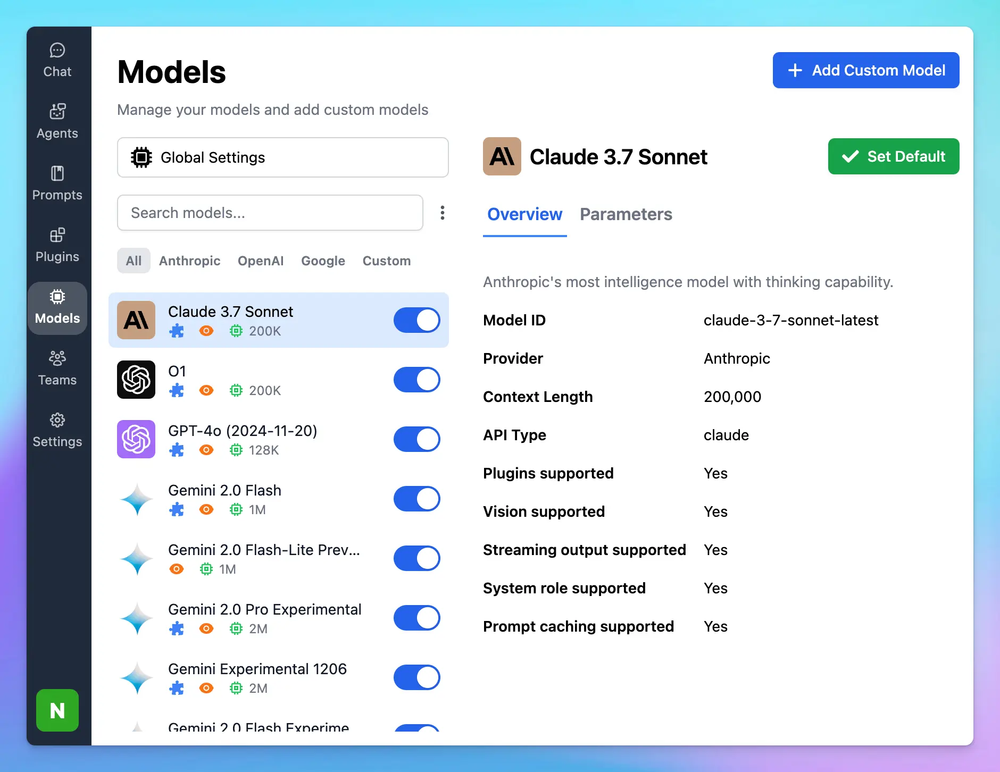

## 🔥 What’s new?

TypingMind now supports Claude 3.7 Sonnet! (reload the app to update!)

💡 New "Thinking Mode" feature

⚙️ Extremely long output! (up to 128K tokens, you can change the max_tokens param in TypingMind to use this)

🧠 Top performance on SWE-bench

🚅 Super fast!

## 📌 Stay updated

Follow us on [X](https://x.com/TypingMindApp), [LinkedIn](https://www.linkedin.com/company/typingmind/), [Facebook](https://www.facebook.com/typingmind), [Instagram](https://www.instagram.com/typingmind_app/) to stay informed about the latest updates, tips, and tutorials.

[https://x.com/TypingMindApp/status/1894200393833292215](https://x.com/TypingMindApp/status/1894200393833292215)