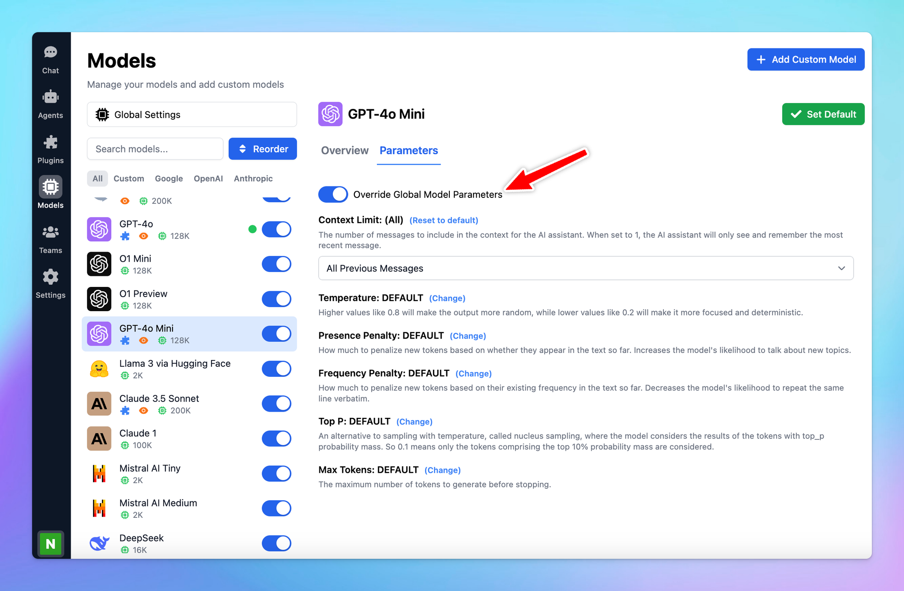

# Custom parameters for each model

You can now set up Custom Parameters for Specific Models!

Customizing parameters for each AI model allows you to optimize their performance based on their specific strengths and your needs. This allows you get the best possible results from each model.

### **🏁 How it works**

- Go to **Model settings** on the left side panel.
- Click on the AI model you want to assign custom parameters to.
- Switch to Parameters tab
- Toggle on **Override Global Model Parameters** to create a custom preset for that AI model. This way, it won't use your global settings.
- Set up the [**parameters value**](https://docs.typingmind.com/parameter-settings/parameter-settings) as you want. (Context limit, Temperature, Top-p, Top-k, Max tokens, etc.)

Learn more: https://docs.typingmind.com/parameter-settings/custom-parameters-for-each-model

### 📌 Stay updated

Follow us on [Twitter](https://x.com/TypingMindApp) to stay informed about the latest updates, tips, and tutorials: 

[https://x.com/TypingMindApp/status/1843309558145646941](https://x.com/TypingMindApp/status/1843309558145646941)