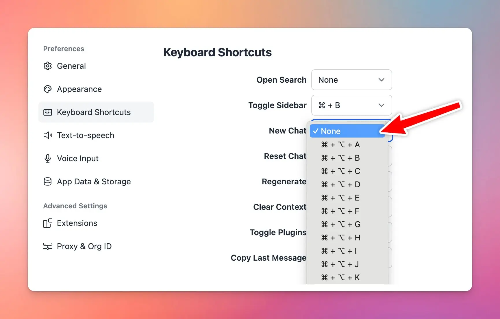

## **🚀 What's New?**

Added an option to deactivate individual keyboard shortcuts!

Learn more: https://docs.typingmind.com/general-settings/keyboard-shortcuts

## ✨ Stay updated

Follow us on [Twitter](https://x.com/TypingMindApp) to stay informed about the latest updates, tips, and tutorials: 

[https://twitter.com/TypingMindApp/status/1775011021532655715](https://twitter.com/TypingMindApp/status/1775011021532655715)