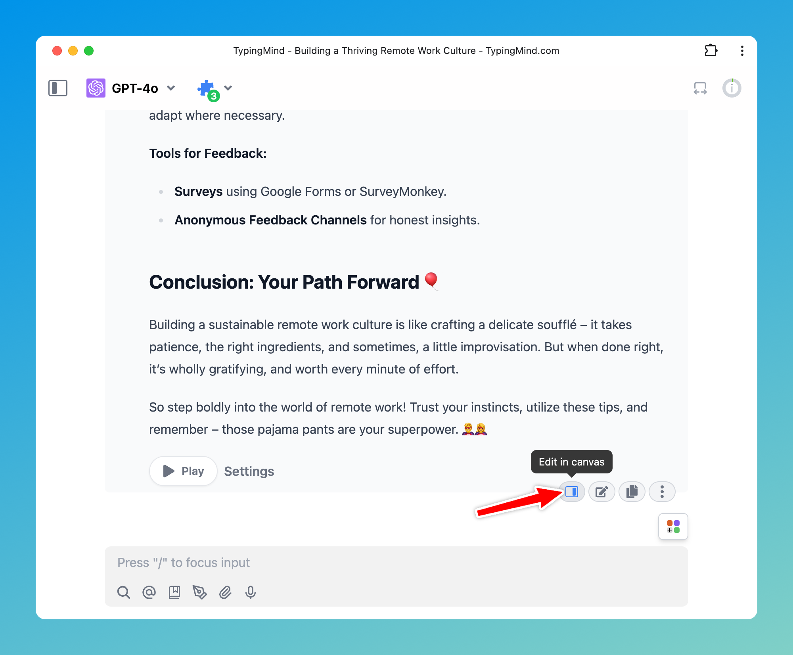

**TypingMind Edit in Canvas** is here to streamline your workflow by allowing you to directly refine responses in a dedicated canvas, especially when you need to edit, collaborate, or review your work. 

## 🔥 What’s New?

**Edit in Canvas on TypingMind**

is great for editing and revising the AI response to improve AI-generated responses that meet your goals without switching back-and-forth within your conversation.Edit in Canvas can make your work smoother and more effective by allowing you to:

- **Edit text or code directly**: make changes instantly, add or adjust your text or code.
- **Rewrite specific parts of your text or the entire message**: make your text longer, shorter, friendlier or enter custom prompts to adjust tone, voice, style of your text.
- **Use markdown formatting**: you update basic styles for your text including bold, italics, headers, lists, quotes, and more.

Learn more: https://docs.typingmind.com/chat-management/edit-in-canvas

## **🏁 How it works**

- You can pick an AI model and start a conversation to work on your project.
- When you receive an AI response, hover over it and click "Edit in Canvas."
- Clicking "Edit in Canvas" opens a window on the right where you can easily see and edit the response.

## 📌 Stay updated

Follow us on [Twitter](https://x.com/TypingMindApp) to stay informed about the latest updates, tips, and tutorials: 

[https://x.com/TypingMindApp/status/1853648923245838427](https://x.com/TypingMindApp/status/1853648923245838427)