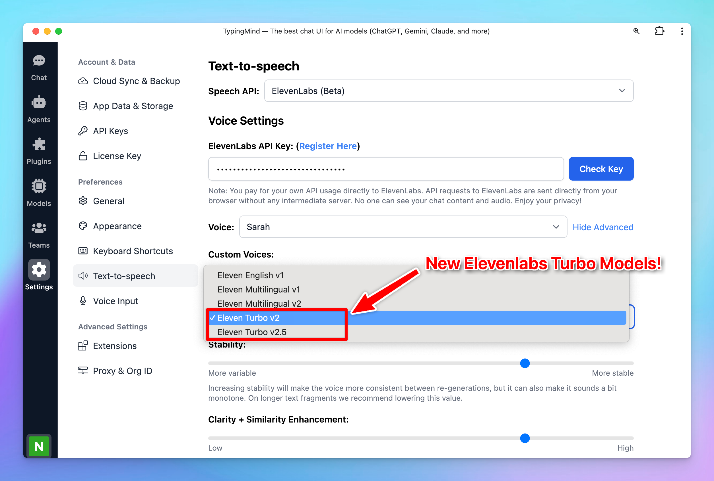

New ElevenLabs Text-to-speech models - Eleven Turbo v2.5 and Eleven Turbo v2 are now available!

## 🔥 What’s New?

- **Eleven Turbo v2.5**
    - Support 32 languages (with new languages such as Vietnamese, Hungarian, and Norwegian)
    - Latency is as low as 300ms - ideal for real-time interactions (300% faster than Multilingual v2)
    - 50% cheaper than previous models
- **Eleven Turbo v2**
    - Similar in performance to Turbo v2.5 but focused exclusively on English, making it ideal for English-only use cases where speed is critical.

## 📌 Stay updated

Follow us on [Twitter](https://x.com/TypingMindApp) to stay informed about the latest updates, tips, and tutorials: 

[https://x.com/TypingMindApp/status/1845675901574353142](https://x.com/TypingMindApp/status/1845675901574353142)