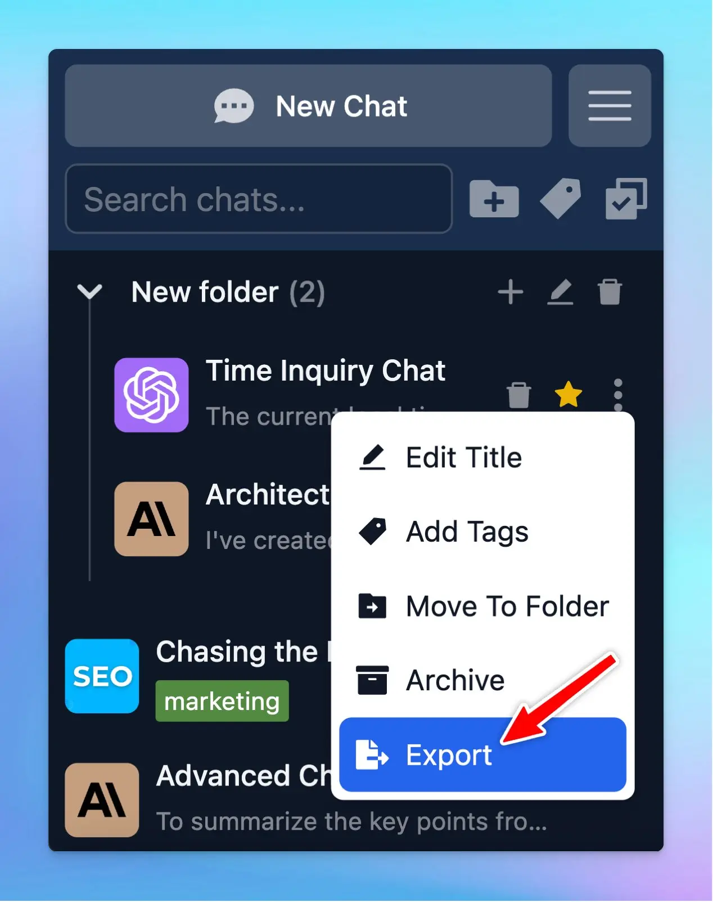

You now can export a single chat or multiple selected chats (at once)!

### **🏁 How it works:**

- Choose the chat (one or some) you want to export as JSON
- Directly choose export for one chat/ To export multiple chats at once, choose bulk action → export

To help you clearly understand about sharing/export the chat, check out here: 

https://docs.typingmind.com/chat-management/shareexport-a-chat

### ✨ Stay updated:

Follow us on [Twitter](https://x.com/TypingMindApp) to stay informed about the latest updates, tips, and tutorials: 

[https://twitter.com/TypingMindApp/status/1828100296205316394](https://twitter.com/TypingMindApp/status/1828100296205316394)