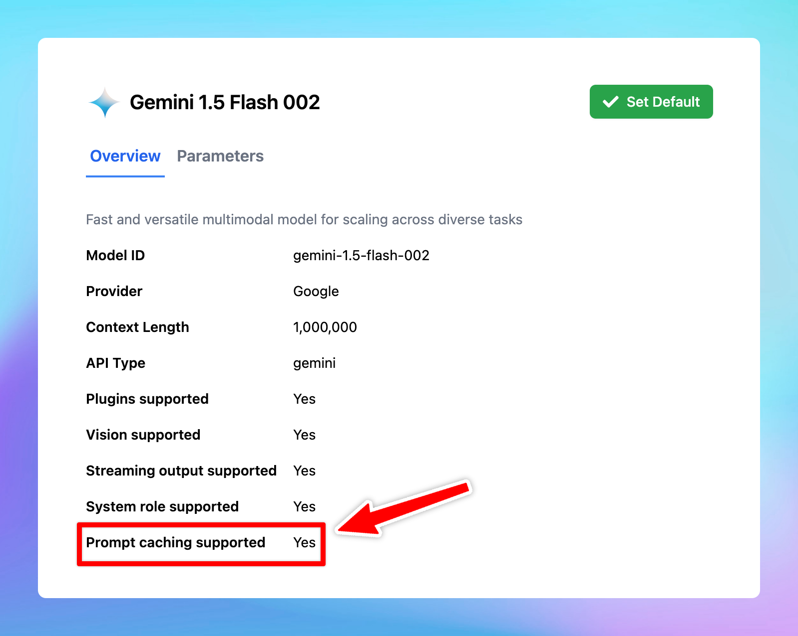

# Gemini Context Caching

Gemini Context Caching is now available on TypingMind! 🔥

Supported models:

- Gemini 1.5 Pro
- Gemini 1.5 Flash

The minimum input token count for context caching is 32,768.

<aside>
💡

Prompt Caching allows users to make repeated API calls more efficiently by reusing context from recent prompts, resulting in a reduction in input token costs and faster response times.

The Prompt Caching option is now available for Claude, OpenAI and Google Gemini models.

</aside>

## **🏁 How it works**

- Go to **Model Settings**
- Expand the **Advanced Model Parameter**
- Scroll down to enable the “**Prompt Caching**” option

Learn more https://docs.typingmind.com/prompts/automatic-prompt-caching

### 📌 Stay updated

Follow us on [Twitter](https://x.com/TypingMindApp) to stay informed about the latest updates, tips, and tutorials: 

[https://x.com/TypingMindApp/status/1848660063898243266](https://x.com/TypingMindApp/status/1848660063898243266)