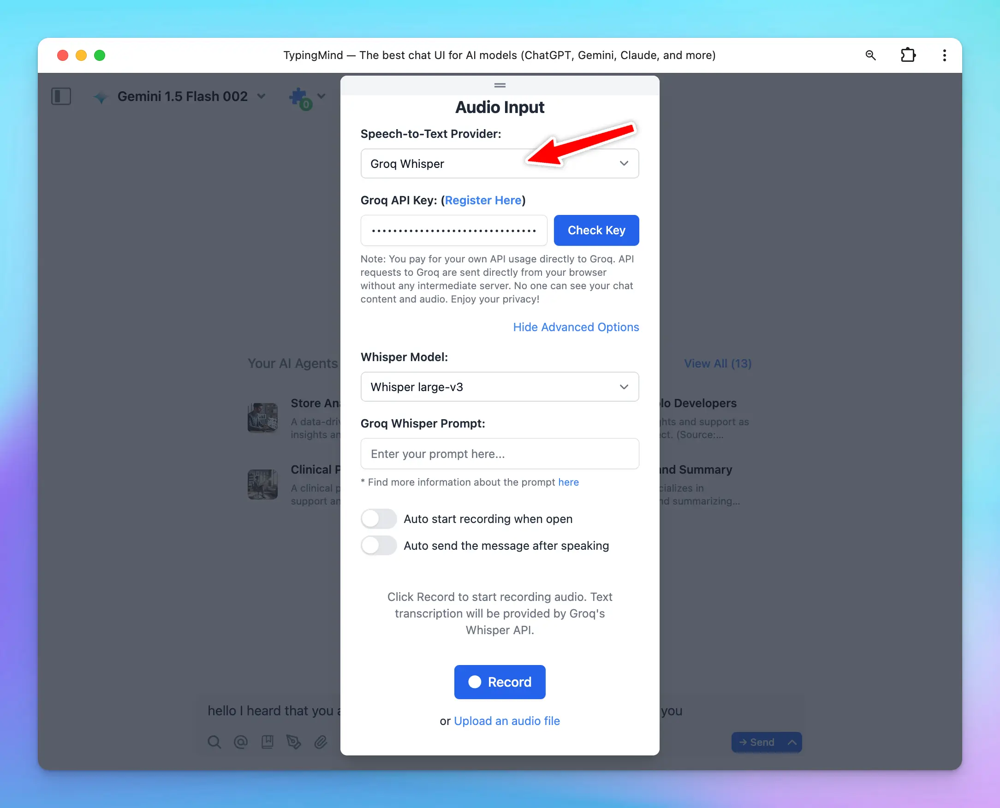

**Groq Whisper for Speech-to-Text (Audio Input)** is now available on TypingMind!

Supported models:

🔸Whisper large-v3: provide high accuracy for multilingual transcription tasks.

🔸Distill-Whisper English: provide faster, lower cost English speech recognition while maintaining comparable accuracy.

## **🏁 How it works**

- Click the microphone icon within the message area
- Select Speech-to-Text provider as Groq Whisper
- Enter your [Groq API Key](https://console.groq.com/keys) and click Check key
- Toggle the Advanced Options to select a Whisper model and enter the [Groq Whisper prompt](https://console.groq.com/docs/speech-text#prompting-guidelines)

## 📌 Stay updated

Follow us on [Twitter](https://x.com/TypingMindApp) to stay informed about the latest updates, tips, and tutorials: 

[https://x.com/TypingMindApp/status/1846196833804341746](https://x.com/TypingMindApp/status/1846196833804341746)