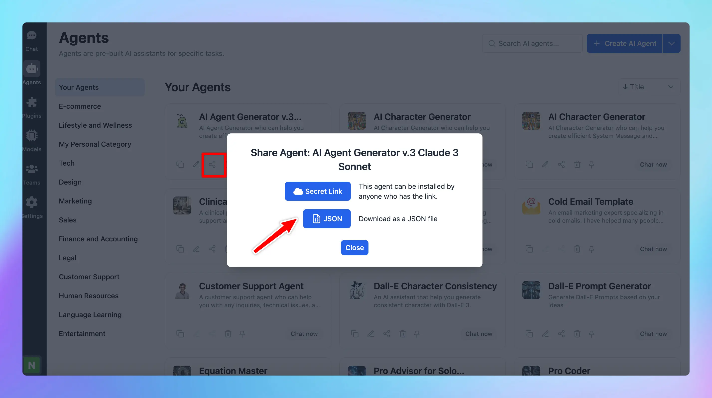

Now you can export an AI Agent as JSON file so you or your team can easily import it to their workplace.

## ⚙️ How it works?

- Go to AI Agent
- Click the Share icon on the bottom of each AI Agent to share as JSON

Export AI Agent as JSON

- Click on the drop-down icon next to the Create AI Agent button and click “Import from JSON” to import the AI Agent.

Import AI Agent 

## 📌 Stay updated

Follow us on [Twitter](https://x.com/TypingMindApp) to stay informed about the latest updates, tips, and tutorials.