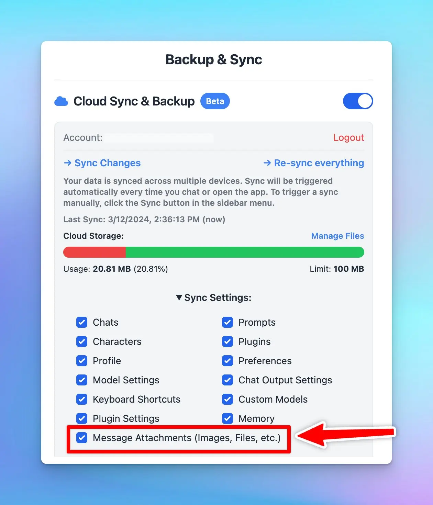

## **🚀 What's New?**

Choose to include or exclude "Message Attachments" when syncing to save cloud space.
**Message attachments: your uploaded files to the app such as images or documents.*

## ⚙️ How it works?

Open Manage Cloud Sync → Toggle the Sync settings and select or deselect message attachments.

### ✨ Stay updated

Follow us on [Twitter](https://x.com/TypingMindApp) to stay informed about the latest updates, tips, and tutorials: 

[https://twitter.com/TypingMindApp/status/1767560427473641549](https://twitter.com/TypingMindApp/status/1767560427473641549)