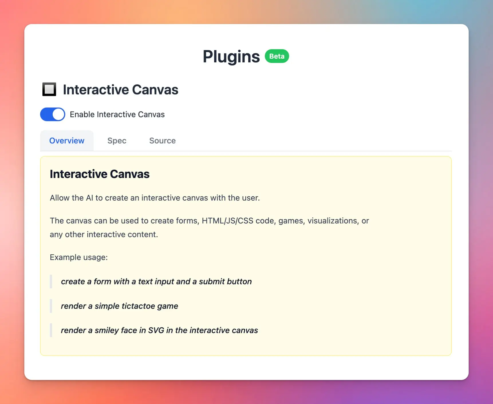

✅ We’ve launched a new plugin: Interactive Canvas

### **🚀 What's New?**

New and powerful plugin - Interactive Canvas is now available on TypingMind. 

This allows AI model to:

- Generate UI elements, games, charts, forms, etc.
- Interactive experiences for you users directly in TypingMind
- Can view and copy source (HTML/JS/CSS)

### ✨ Stay updated:

Follow us on [Twitter](https://x.com/TypingMindApp) to stay informed about the latest updates, tips, and tutorials: 

[https://twitter.com/TypingMindApp/status/1805359964367511692](https://twitter.com/TypingMindApp/status/1805359964367511692)