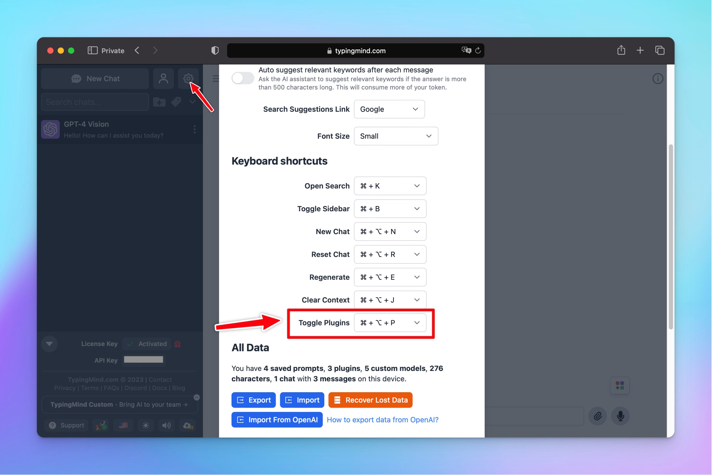

## **🚀 What's New?**

A new keyboard shortcut for activating and deactivating plugins.

Learn more about other shortcuts: https://docs.typingmind.com/general-settings/keyboard-shortcuts

## ✨ Stay updated

Follow us on [Twitter](https://x.com/TypingMindApp) to stay informed about the latest updates, tips, and tutorials:

[https://twitter.com/TypingMindApp/status/1724290057685864774](https://twitter.com/TypingMindApp/status/1724290057685864774)