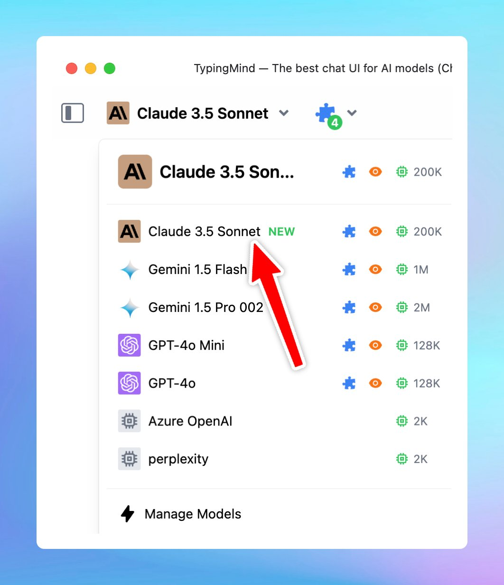

# New Claude 3.5 Sonnet

We have just added the new Claude 3.5 Sonnet model (claude-3-5-sonnet-20241022)!

## **🏁 What’s new?**

The new model is smarter, more capable, and still at the same cost!

Plus, you can easily [build powerful AI Agents](https://docs.typingmind.com/ai-agents/ai-agents-overview) on TypingMind with this upgraded model.

More details on the model: [New Claude 3.5 Sonnet](https://www.anthropic.com/news/3-5-models-and-computer-use)

## 📌 Stay updated

Follow us on [Twitter](https://x.com/TypingMindApp) to stay informed about the latest updates, tips, and tutorials: 

[https://x.com/TypingMindApp/status/1848971503066616067](https://x.com/TypingMindApp/status/1848971503066616067)