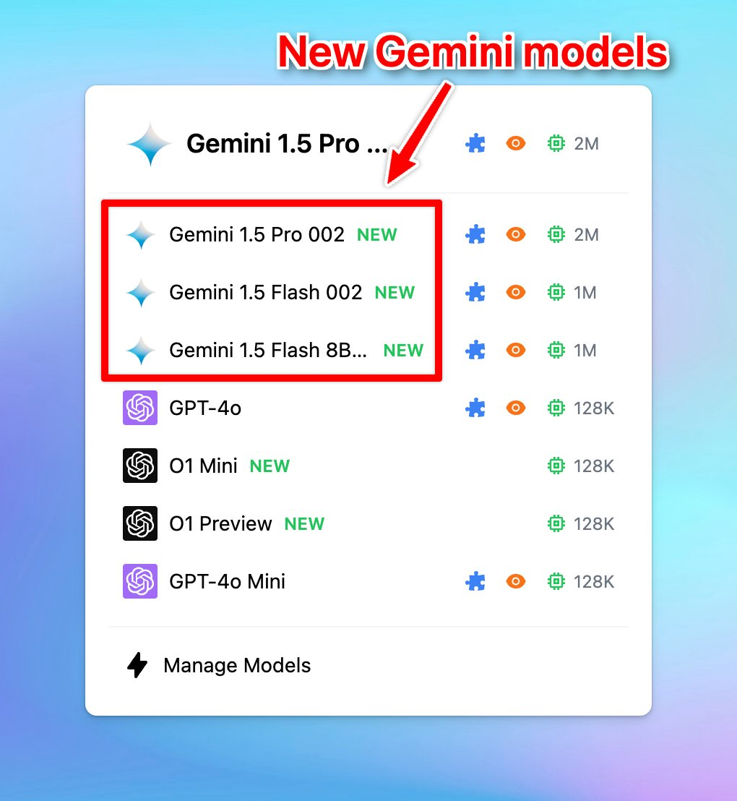

🧩 New Gemini Models are now available on TypingMind!

### **🚀 What's New?**

We have just updated these new Gemini models: on TypingMind: 

- Gemini Flash 8B Experimental 0924
- Gemini 1.5 Flash 002
- Gemini 1.5 Pro 002

### ❓**Why This Matters**

New models bring better performance and better experience: 

- Rate limits increased: 2x for Flash, 3x for Pro.
- 2x faster output and 3x lower latency
- Improved performance for tasks like math, vision, and code generation.

Easy access Google's Gemini AI models with [typingmind.com](http://typingmind.com): 

https://docs.typingmind.com/chat-models-settings/use-with-gemini

### ✨ Stay updated

Follow us on [Twitter](https://x.com/TypingMindApp) to stay informed about the latest updates, tips, and tutorials: 

[https://x.com/TypingMindApp/status/1839171597393080558](https://x.com/TypingMindApp/status/1839171597393080558)