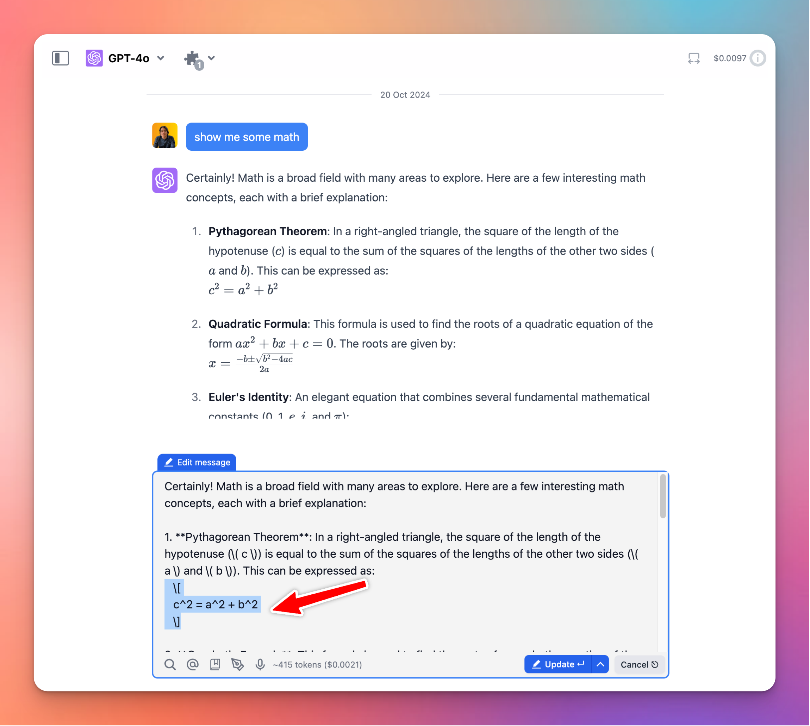

# New Math Syntax

We have just improved math syntax display on TypingMind!

### **🚀 What's New?**

Support both `\(`, `\[`, and `$$` syntax when displaying math expressions.

### ✨ Stay updated:

Follow us on [Twitter](https://x.com/TypingMindApp) to stay informed about the latest updates, tips, and tutorials: 

[https://x.com/TypingMindApp/status/1848374180229918970](https://x.com/TypingMindApp/status/1848374180229918970)